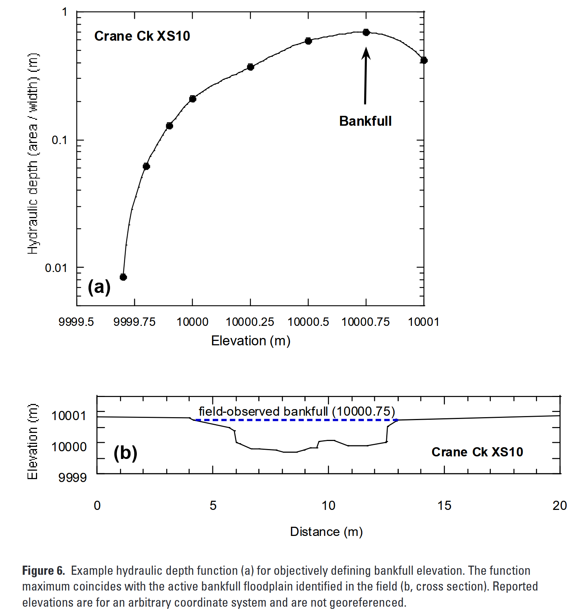

# Channel Geometry from a DEM
Dan
2025-03-04

## A new algorithm

A several recent papers discussed an algorithm for measuring channel
width directly from a DEM using extracted channel cross sections: (Faux
et al. 2009; De Rosa, Fredduzzi, and Cencetti 2019; Garber et al. 2024).
The “hydraulic depth” (channel cross-section area divided by channel
width) is plotted against a flow stage (elevation above channel), as
shown in this figure from Faux et al. (2009):

The hydraulic depth indicates the mean depth across the cross section.
As the examined stage increases, both the cross-sectional area and the
width increase, but at different rates. A maximum in the hydraulic depth
provides an indication of possible bank-full depth measured from the
inferred channel centerline.

An alternative to this is to measure water volume and inundation area
over a reach as a function of stage. The mean depth is then given by the
volume divided by inundation area. A maximum in mean depth as a function
of stage indicates the stage corresponding, maybe, to bankfull depth.

A problem with this is that we have no lidar returns over open water, so
our measure of bankfull depth does not include the water stage at the
time of lidar aquisition. Nevertheless, measures of channel width
obtained with this approach should be valid.

How to do this? A tentative workflow:

1.  Generate “closest-node” and “height-above” rasters with program
    valleyFloor.

2.  Define a channel reach, centered over a single node and extending an
    equal number of nodes up and downstream. Clip out the area
    associated with this reach from the rasters above.

3.  Allocate an empty array for stage and volume increments. These may
    be scaled by an initial estimate of channel depth, e.g., 100 bins
    from zero to 10 channel depths.

4.  For each cell in the clipped rasters, compare the height-above for
    that cell to the stage bins. If height above is less than the stage,
    increment the bin value for that stage by one and the volume for
    that stage by the water depth (stage minus height-above) at that
    cell. Psuedo code:

    allocate(area(nstage))  
    allocate(volume(nstage))  
    area(:) = 0  
    volume(:) = 0  
    for row = 1, nrows \# for the clipped portion of the height-above
    raster  
    ..for col = 1, ncols  
    ….for i = 1, nstages \# nstages is the number of stage increments  
    ……stage = i \* dstage \# dstage is the stage increment, e.g.,
    10\*depth/nstages  
    ……if (stage \> heightAbove(col,row)) then  
    ……..area(i) = area(i) + 1  
    ……..volume(i) = volume(i) + stage - heightAbove(col,row)  
    ……end if  
    ….end for  
    ..end for  
    end for

5.  These arrays now give inundation area and water volume for a range
    of water stages from zero to, say, 10 channel depths above the
    channel. Divide inundation area by inundation volume to get an array
    of mean depth for each stage. Find the stage where the maximum mean
    depth occurs. The channel width associated with that stage is
    inundation area divided by mean depth.

Potential issues:

- This will not work well for channel widths near the DEM cell size.

- Multi-thread channels will produce a combined width and mean depth
  over all channels.

- Poorly resolved channels will not be any better resolved with this
  approach. We might try an iterative approach: 1) Estimate channel
  geometry with a regional regression equation, 2) Measure apparent
  incision, 3) use this algorithm to get a spatially distributed measure
  of channel width, but only for channels with measurable incision.

De Rosa, Pierluigi, Andrea Fredduzzi, and Corrado Cencetti. 2019. “A
GIS-Based Tool for Automatic Bankfull Detection from Airborne High
Resolution Dem.” *ISPRS International Journal of Geo-Information* 8
(11). <https://doi.org/10.3390/ijgi8110480>.

Faux, Russell N, J. M. Buffington, M. G. Whitley, S. H. Lanigan, and B.
B. Roper. 2009. “Use of Airborne Near-Infrared LiDAR for Determining
Channel Cross-Section Characteristics and Monitoring Aquatic Habitat in
Pacific Northwest Rivers: A Preliminary Analysis.” In.
<https://research.fs.usda.gov/treesearch/33564>.

Garber, Jonathan, Karen Thompson, Matthew J. Burns, Joshphar Kunapo,
Geordie Z. Zhang, and Kathryn Russell. 2024. “Artificial Intelligence
and Objective-Function Methods Can Identify Bankfull River Channel
Extents.” *Water Resources Research* 60 (1): e2023WR035269.
<https://doi.org/10.1029/2023WR035269>.

