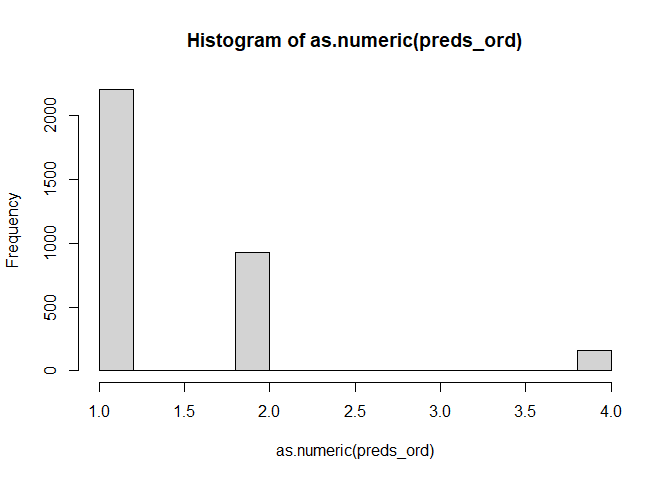
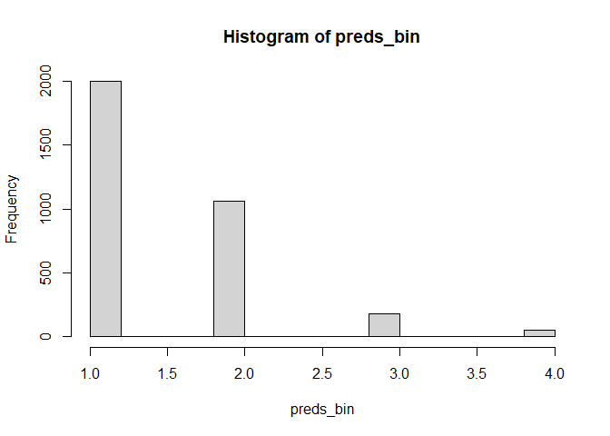
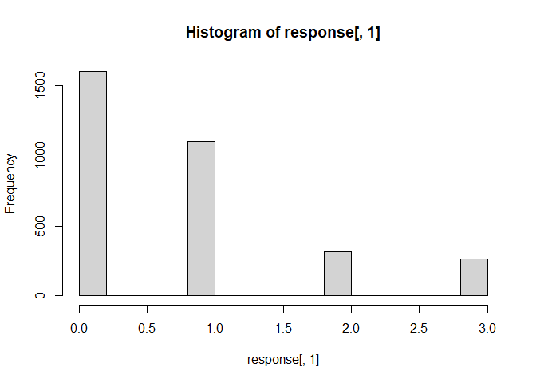
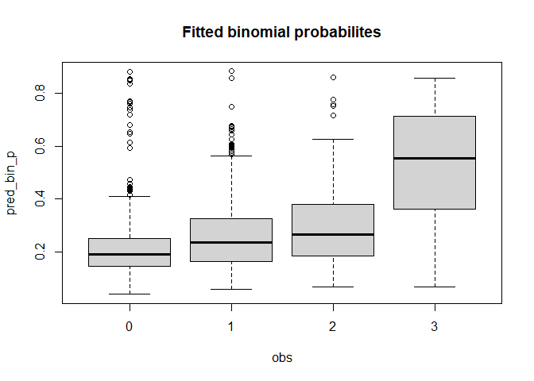
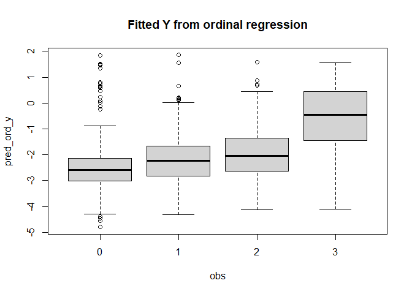
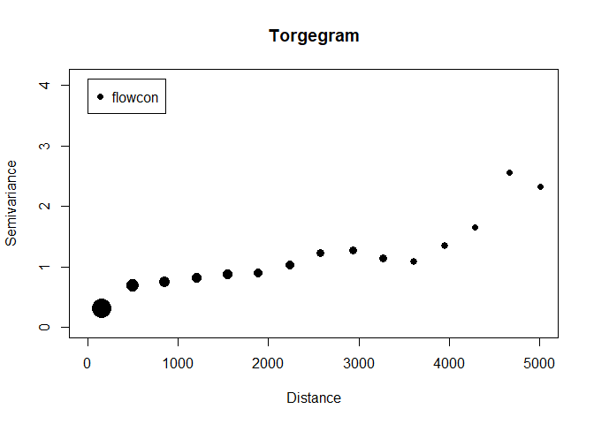
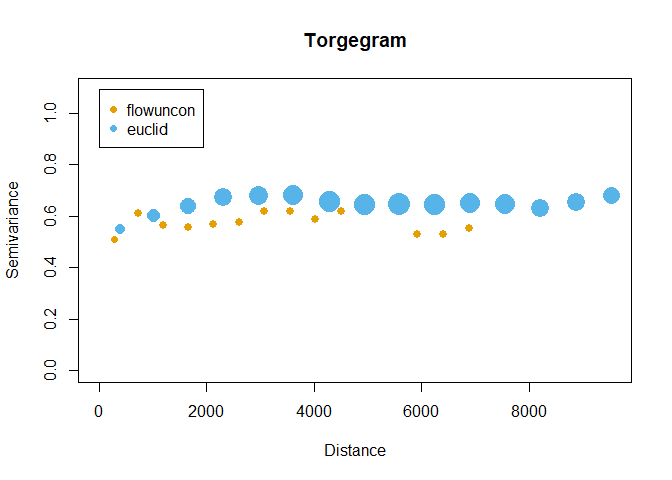
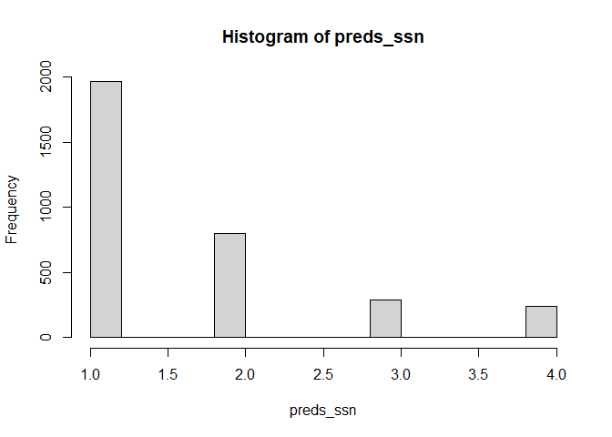
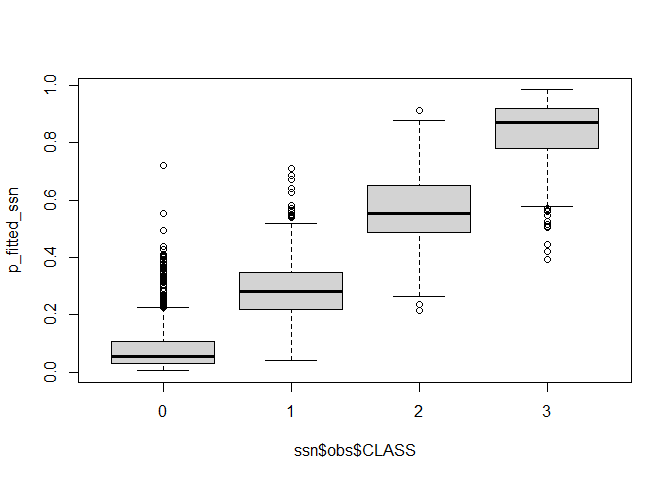

Fit width class data using SSN
================
Helen
today

Step 1: Load the data

``` r
library(sf)
```

    ## Linking to GEOS 3.9.3, GDAL 3.5.2, PROJ 8.2.1; sf_use_s2() is TRUE

``` r
library(sfnetworks)
library(SSN2)
library(ggplot2)
library(data.table)

nodes <- read_sf("data/AreaC_Nodes/")
reaches <- read_sf("data/reaches/")
nodes$CLASS <-  as.numeric(factor(nodes$SurvType, 
                        levels = c("EPH", 
                                   "INT", 
                                   "TRANS", 
                                   "SMPRM", 
                                   "LGPRM")))
nodes$CLASS <- nodes$CLASS - 1

reaches$CLASS <- ifelse(reaches$CLASS %in% c(-9999, 0), NA, reaches$CLASS) - 1

# match up nodes to the nearest reach id
st_crs(nodes) <- st_crs(reaches)
nodes_matched <- st_join(nodes, reaches[c("REACH_ID")], all.x = TRUE, all.y = FALSE, join = st_nearest_feature)
names(reaches)
```

    ## [1] "REACH_ID"   "LENGTH_M"   "AREA_SQKM"  "CLASS"      "WIDTH_M"   
    ## [6] "GRADIENT"   "INCISION_M" "geometry"

# fit a linear model.

Here I fit both a binomial model and an ordinal model to compare
outcomes.

Note that binomial regression is generally used for a somewhat different
scenario. It assumes that your response is a binomial random variable,
which models the number of successes out of n trials where the
probability of success for each trial is p. Binomial regression assumes
that p varies with covariates, such that

``` r
data <- as.data.table(reaches[!is.na(reaches$CLASS), ])

# Start with ordinal regression 
m_ord <- MASS::polr(
  as.factor(CLASS) ~ log10(AREA_SQKM) + GRADIENT, 
  data = data, 
  Hess = TRUE)
summary(m_ord)
```

    ## Call:
    ## MASS::polr(formula = as.factor(CLASS) ~ log10(AREA_SQKM) + GRADIENT, 
    ##     data = data, Hess = TRUE)
    ## 
    ## Coefficients:
    ##                  Value Std. Error t value
    ## log10(AREA_SQKM) 1.511    0.06449  23.433
    ## GRADIENT         1.469    0.59858   2.454
    ## 
    ## Intercepts:
    ##     Value    Std. Error t value 
    ## 0|1  -2.3657   0.1046   -22.6191
    ## 1|2  -0.5224   0.0969    -5.3938
    ## 2|3   0.5745   0.0997     5.7619
    ## 
    ## Residual Deviance: 6843.635 
    ## AIC: 6853.635

``` r
coef(m_ord)
```

    ## log10(AREA_SQKM)         GRADIENT 
    ##         1.511214         1.468787

``` r
preds_ord_y <- coef(m_ord)[1] * log10(data$AREA_SQKM) + 
  coef(m_ord)[2] * data$GRADIENT
preds_ord <- predict(m_ord)
hist(as.numeric(preds_ord))
```

<!-- -->

``` r
# binomial regression? 
# at least it will return the correct data type, I guess

response <- matrix(c(data$CLASS, 3-data$CLASS), ncol = 2)

m_bin <- glm(response ~ log10(AREA_SQKM) + GRADIENT, family = binomial(link = "logit"), data = data)

summary(m_bin)
```

    ## 
    ## Call:
    ## glm(formula = response ~ log10(AREA_SQKM) + GRADIENT, family = binomial(link = "logit"), 
    ##     data = data)
    ## 
    ## Deviance Residuals: 
    ##     Min       1Q   Median       3Q      Max  
    ## -3.5838  -1.1278  -0.5263   0.7272   4.0111  
    ## 
    ## Coefficients:
    ##                  Estimate Std. Error z value Pr(>|z|)    
    ## (Intercept)       0.58475    0.06256   9.347   <2e-16 ***
    ## log10(AREA_SQKM)  1.17095    0.04214  27.785   <2e-16 ***
    ## GRADIENT          0.95618    0.43437   2.201   0.0277 *  
    ## ---
    ## Signif. codes:  0 '***' 0.001 '**' 0.01 '*' 0.05 '.' 0.1 ' ' 1
    ## 
    ## (Dispersion parameter for binomial family taken to be 1)
    ## 
    ##     Null deviance: 5828.1  on 3286  degrees of freedom
    ## Residual deviance: 4752.3  on 3284  degrees of freedom
    ## AIC: 7059.7
    ## 
    ## Number of Fisher Scoring iterations: 4

``` r
preds <- predict(m_bin, type = "response")

f_bin <- sapply(preds, \(p) dbinom(0:3, size = 3, prob = p)) |> t()
preds_bin <- sapply(preds, \(p) which.max(dbinom(0:3, size = 3, prob = p)))
hist(preds_bin)
```

<!-- -->

``` r
hist(response[, 1])
```

<!-- -->

### Compare model predictions.

They are similar. For some reason ordinal regression is never predicting
class 2. Some model fit stats are shown below, and a confusion matrix
where the “reference” is the ordinal regression predictions and
“prediction” is binomial predictions.

The binomial model tends to predict lower than ordinal regression and
never predicts higher than ordinal regression.

``` r
library(caret)
```

    ## Loading required package: lattice

``` r
validation <- data.table(obs = data$CLASS, pred_bin = preds_bin-1, pred_ord = preds_ord, 
                         pred_bin_p = preds, 
                         pred_ord_y = preds_ord_y)
mx_ord <- confusionMatrix(as.factor(validation$obs), as.factor(validation$pred_ord))
mx_bin <- confusionMatrix(as.factor(validation$obs), as.factor(validation$pred_bin))

knitr::kable(data.table(
  model = c("Binomial", "Ordinal logistic"), 
  RMSE = c(sqrt(mean((validation$obs - validation$pred_bin)^2)), 
           sqrt(mean((validation$obs - as.numeric(validation$pred_ord))^2))), 
  accuracy = c(
    mx_ord$overall["Accuracy"],
    mx_bin$overall["Accuracy"])
))
```

| model            |      RMSE |  accuracy |
|:-----------------|----------:|----------:|
| Binomial         | 0.9100059 | 0.5561302 |
| Ordinal logistic | 1.0825383 | 0.5202312 |

``` r
boxplot(pred_bin_p ~ obs, data = validation, main = "Fitted binomial probabilites")
```

<!-- -->

``` r
boxplot(pred_ord_y ~ obs, data = validation, main = "Fitted Y from ordinal regression")
```

<!-- -->

``` r
confusionMatrix(as.factor(validation$pred_bin), as.factor(validation$pred_ord))
```

    ## Confusion Matrix and Statistics
    ## 
    ##           Reference
    ## Prediction    0    1    2    3
    ##          0 1996    0    0    0
    ##          1  208  853    0    0
    ##          2    0   74    0  103
    ##          3    0    0    0   53
    ## 
    ## Overall Statistics
    ##                                           
    ##                Accuracy : 0.8829          
    ##                  95% CI : (0.8714, 0.8937)
    ##     No Information Rate : 0.6705          
    ##     P-Value [Acc > NIR] : < 2.2e-16       
    ##                                           
    ##                   Kappa : 0.7662          
    ##                                           
    ##  Mcnemar's Test P-Value : NA              
    ## 
    ## Statistics by Class:
    ## 
    ##                      Class: 0 Class: 1 Class: 2 Class: 3
    ## Sensitivity            0.9056   0.9202       NA  0.33974
    ## Specificity            1.0000   0.9119  0.94615  1.00000
    ## Pos Pred Value         1.0000   0.8040       NA  1.00000
    ## Neg Pred Value         0.8389   0.9668       NA  0.96815
    ## Prevalence             0.6705   0.2820  0.00000  0.04746
    ## Detection Rate         0.6072   0.2595  0.00000  0.01612
    ## Detection Prevalence   0.6072   0.3228  0.05385  0.01612
    ## Balanced Accuracy      0.9528   0.9160       NA  0.66987

# Fit a spatial model

Load and explore the .ssn object. The torgegram shows the semivariance
for three different types of distance:  
- flowcon: stream distance betweeen flow-connected points - flowuncon:
stream distance between all (flow-connected and -unconnected points) -
euclid: Euclidean distance

The scale of variance seems to be different between flow-connected
points and others, so we will plot them separately.

``` r
library(SSN2)
ssn <-  ssn_import(
  path = "data/ssn_files_keep/ssn.ssn",
  predpts = c("preds"), 
  overwrite = TRUE
)

tg_connected <- Torgegram(
  formula = CLASS ~ log10(AREA_SQKM) + GRADIENT,
  ssn.object = ssn,
  type = c("flowcon")
)
plot(tg_connected)
```

<!-- -->

``` r
tg_unconnected <- Torgegram(
  formula = CLASS ~ log10(AREA_SQKM) + GRADIENT,
  ssn.object = ssn,
  type = c("flowuncon", "euclid")
)
plot(tg_unconnected)
```

<!-- -->

There clearly is increasing variance between flow-connected points. I
don’t really see this pattern in flow-unconnected points but there is
some increasing variance between euclidan distance. This indicates that
a tail-up variance component would be appropriate, and potentially also
a component for euclidean distance.

Unfortunately, I am getting an error when I attempt to fit a tail-up
spatial effect. I’m not sure why, but it may be related to the large
number of separated networks. Instead, let’s fit a tail-down effect.

``` r
# this took about 30 min
ssn_mod_binom <- ssn_glm(
  matrix(c(CLASS, 3-CLASS), ncol = 2) ~ log10(AREA_SQKM) + GRADIENT, 
                   family = "binomial",
                   ssn,  
                   taildown_type = "exponential",
                   additive = "afvArea")

# ssn_mod_binom <- ssn_glm(CLASS ~ log10(AREA_SQKM) + GRADIENT, 
#                    family = "binomial",
#                    size = 3,
#                    ssn,  
#                    taildown_type = "exponential",
#                    additive = "afvArea")
# t3 <- Sys.time()
# ssn_mod_gamma <- ssn_glm(CLASS ~ log10(AREA_SQKM) + GRADIENT, 
#                          family = "gamma",
#                          ssn,  
#                          taildown_type = "exponential",
#                          additive = "afvArea")
```

``` r
summary(ssn_mod_binom)
```

    ## 
    ## Call:
    ## ssn_glm(formula = matrix(c(CLASS, 3 - CLASS), ncol = 2) ~ log10(AREA_SQKM) + 
    ##     GRADIENT, ssn.object = ssn, family = "binomial", taildown_type = "exponential", 
    ##     additive = "afvArea")
    ## 
    ## Deviance Residuals:
    ##     Min      1Q  Median      3Q     Max 
    ## -2.7637 -0.5909 -0.2918  0.3542  2.3700 
    ## 
    ## Coefficients (fixed):
    ##                  Estimate Std. Error z value Pr(>|z|)    
    ## (Intercept)      -0.49716    0.19231  -2.585  0.00973 ** 
    ## log10(AREA_SQKM)  0.87218    0.06291  13.863  < 2e-16 ***
    ## GRADIENT         -1.00256    0.73066  -1.372  0.17002    
    ## ---
    ## Signif. codes:  0 '***' 0.001 '**' 0.01 '*' 0.05 '.' 0.1 ' ' 1
    ## 
    ## Pseudo R-squared: 0.1151
    ## 
    ## Coefficients (covariance):
    ##                 Effect     Parameter   Estimate
    ##   taildown exponential  de (parsill)  3.166e+00
    ##   taildown exponential         range  1.299e+03
    ##                 nugget        nugget  4.360e-03
    ##             dispersion    dispersion  1.000e+00

Parameter estimates are pretty different between the spatial and
non-spatial binomial models. Let’s look at fitted values.

``` r
# for some reason they get transformed to be between 0 and 3 
# when you say type = "response"
p_fitted_ssn <- plogis(fitted(ssn_mod_binom, type = "link"))
f_ssn <- sapply(p_fitted_ssn, \(p) dbinom(0:3, size = 3, prob = p)) |> t()
preds_ssn <- sapply(p_fitted_ssn, \(p) which.max(dbinom(0:3, size = 3, prob = p)))

hist(preds_ssn)
```

<!-- -->

``` r
boxplot(p_fitted_ssn ~ ssn$obs$CLASS)
```

<!-- -->

``` r
ssn_mx <- confusionMatrix(as.factor(ssn$obs$CLASS), as.factor(preds_ssn -1))
sqrt(mean((ssn$obs$CLASS - (preds_ssn -1))^2))
```

    ## [1] 0.4591629

``` r
knitr::kable(data.table(
  model = c("Binomial", "Ordinal logistic", "SSN (binomial)"), 
  RMSE = c(sqrt(mean((validation$obs - validation$pred_bin)^2)), 
           sqrt(mean((validation$obs - as.numeric(validation$pred_ord))^2)), 
           sqrt(mean((ssn$obs$CLASS - (preds_ssn -1))^2))), 
  accuracy = c(
    mx_ord$overall["Accuracy"],
    mx_bin$overall["Accuracy"], 
    ssn_mx$overall["Accuracy"])
))
```

| model            |      RMSE |  accuracy |
|:-----------------|----------:|----------:|
| Binomial         | 0.9100059 | 0.5561302 |
| Ordinal logistic | 1.0825383 | 0.5202312 |
| SSN (binomial)   | 0.4591629 | 0.7955583 |

This is a pretty significant improvement in fitted values. However, it
is not perfect, despite the spatial fitting we are doing. There are
likely a couple of reasons. The first is that the spatial smoothing that
is included in the model fit is a smoother, it doesn’t snap values
exactly to observations. The second is the type of model we are using.
We are using binomial regression, which is different from ordinal
regression but can be fit to data which looks similar (integer data
within a set range). Rather than predict an ordinal class, binomial
regression predicts a probability. We can then translate that
probability into a predicted number, but that’s not really what it’s
designed for.

Another implication of using binomial rather than ordinal regression is
that it will be difficult to get sensible estimates of uncertainty from
the model output. We can use uncertainty estimates for regression
parameters but there is no variance or dispersion parameter in binomial
regression which can be fit to describe variation around the predicted
mean. Quasi-binomial (which is built in to the glm function) or ordinal
regression does fit a dispersion parameter. Without modifying the SSN2
codebase to allow fitting ordinal or quasibinomial models, we might be
able to back out a bootstrapped estimate of prediction uncertianty.
