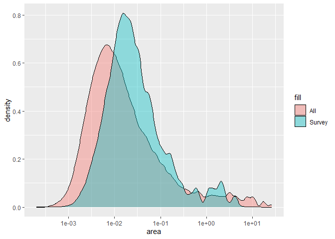
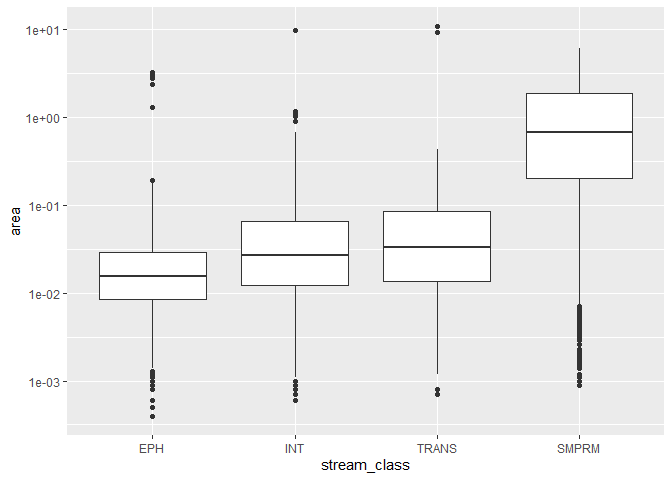
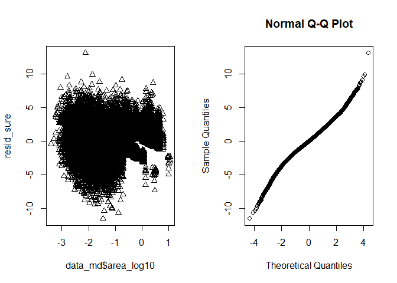
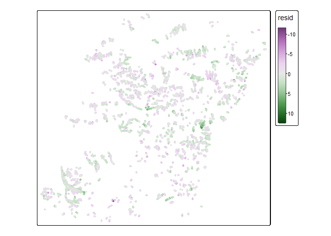
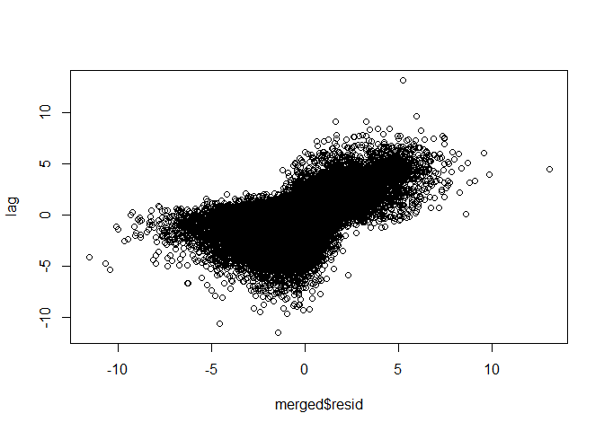
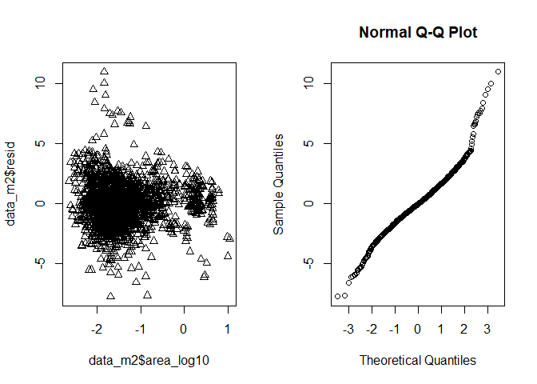
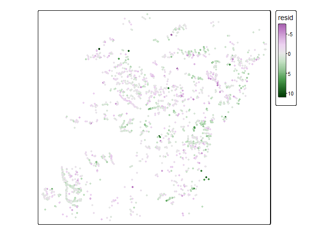
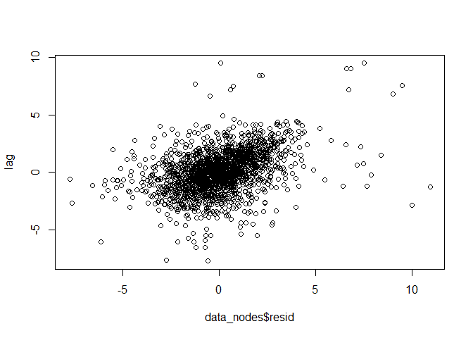

Ordinal logistic regression
================

``` r
suppressPackageStartupMessages({
  library(sf)
  library(terra)
  library(tmap)
  library(data.table)
  library(ggplot2)
  library(PResiduals)
  library(sure)
})
```

    ## Warning: package 'terra' was built under R version 4.4.1

    ## Warning: package 'PResiduals' was built under R version 4.4.2

``` r
# elev <- rast("streams_clipped/elev_areactest.tif")
nodes <- read_sf("streams_clipped/nodes_testc.shp")
cut_blocks <- read_sf("streams_clipped/cut_blocks.shp")
streams <- read_sf("streams_clipped/streams_clipped.shp")
```

``` r
# Make sure everything is in the same CRS
# set everything to utm 11N
cut_blocks <- st_transform(cut_blocks, "EPSG:26911")
#elev <- project(elev, "EPSG:26911")
st_crs(nodes) <- "EPSG:26911"

nodes[nodes$SurvReach == -9999, ]$SurvReach <- NA

survey_nodes <- nodes[!is.na(nodes$SurvType) & 
                        nodes$SurvType != "UNKN", ]


# # choose one cut block to work with
# block_id <- "S250922"
# block <- cut_blocks[cut_blocks$BLOCK_ID == block_id, ]
# 
# # trim nodes and streams 
# nodes <- nodes[block, ]
# streams_block <- streams[block, ]
```

In this notebook, I fit an ordinal model to a subset of the data and
evaluate some model fit diagnostics.

Here is what the data looks like:

``` r
# tm_shape(cut_blocks) +
#   tm_lines() +
#   tm_shape(nodes) + 
#   tm_dots(size = 0.05) +
#   tm_shape(streams) + 
#   tm_lines(col = "RIPARIAN_C", lwd = 2)
```

This is the distribution of all nodes in the network vs the nodes which
we have data for.

Survey nodes skew right. I wonder if this may be because nodes with low
contributing area often did not show up as channels (ie width = 0).

``` r
data <- nodes
st_geometry(data) <- NULL
setDT(data)

data <- data[, .(
  NodeNum, 
  stream_class = factor(SurvType, 
                        levels = c("EPH", 
                                   "INT", 
                                   "TRANS", 
                                   "SMPRM", 
                                   "LGPRM")), 
  area = AREA_SQKM, 
  area_log10 = log10(AREA_SQKM), 
  elev = ELEV_M, 
  grad20 = GRAD20, 
  mean_grad = MeanGrad
)]

data_md <- data[!is.na(stream_class)]


ggplot() +
  geom_density(data = data, aes(x = area, fill = "All"), alpha = 0.4) +
  geom_density(data = data_md, aes(x = area, fill = "Survey"), alpha = 0.4) +
  scale_x_continuous(trans = "log10") 
```

<!-- -->

``` r
ggplot(data_md) + 
  geom_boxplot(aes(x = stream_class, y = area)) + 
  scale_y_log10()
```

<!-- -->

``` r
# rms::lrm wasn't working for some reason
# but this presumably does the same thing
# (ordered logistic regression)
m1 <- MASS::polr(
  stream_class ~ area_log10, 
  data = data_md, 
  Hess = TRUE)
summary(m1)
```

    ## Call:
    ## MASS::polr(formula = stream_class ~ area_log10, data = data_md, 
    ##     Hess = TRUE)
    ## 
    ## Coefficients:
    ##            Value Std. Error t value
    ## area_log10 1.932    0.01365   141.6
    ## 
    ## Intercepts:
    ##             Value     Std. Error t value  
    ## EPH|INT       -3.1619    0.0232  -136.3691
    ## INT|TRANS     -1.2657    0.0208   -60.9890
    ## TRANS|SMPRM   -0.0963    0.0206    -4.6794
    ## SMPRM|LGPRM   14.8197   14.9465     0.9915
    ## 
    ## Residual Deviance: 145376.57 
    ## AIC: 145386.57

``` r
f <- fitted(m1)
head(f)
```

    ##         EPH       INT      TRANS      SMPRM        LGPRM
    ## 1 0.3800521 0.4232144 0.12605380 0.07067972 2.530609e-08
    ## 2 0.3810101 0.4228978 0.12567882 0.07041324 2.520345e-08
    ## 3 0.3814912 0.4227380 0.12549090 0.07027986 2.515210e-08
    ## 4 0.3829430 0.4222524 0.12492536 0.06987918 2.499793e-08
    ## 5 0.5151376 0.3610413 0.08178137 0.04203975 1.460186e-08
    ## 6 0.5200684 0.3582371 0.08044295 0.04125161 1.431634e-08

``` r
apply(f, 2, max)
```

    ##          EPH          INT        TRANS        SMPRM        LGPRM 
    ## 9.678419e-01 4.414584e-01 2.843096e-01 8.908256e-01 2.715052e-06

``` r
apply(f, 2, sum)
```

    ##          EPH          INT        TRANS        SMPRM        LGPRM 
    ## 3.529924e+04 2.299833e+04 7.656045e+03 6.865379e+03 4.206827e-03

# Residual analysis

First, we get residuals and plot them using SBS residuals in the
`PResiduals` package.

``` r
# get resid using SBS
resid_sbs <- presid(m1)

par(mfcol = c(1, 2))
plot(x = data_md$area_log10, y = resid_sbs, pch = 2)
qqplot(runif(length(resid_sbs)), resid_sbs)
```

<!-- -->

Next, we use surrogate residuals from the `sure` package.

``` r
resid_sure <- sure::resids(m1)

par(mfcol = c(1, 2))
plot(x = data_md$area_log10, y = resid_sure, pch = 2)
qqnorm(resid_sure)
```

<!-- -->

They look a bit funky, but it might be because our data is not evenly
distributed between classes. Let’s test for spatial autocorrelation.

``` r
# plot residuals
data_md$resid <- resid_sure
merged <- merge(data_md, nodes, by = "NodeNum", all.x = TRUE, all.y = FALSE) |> 
  st_as_sf()

tm_shape(merged) + 
  tm_dots(fill = "resid", 
          fill.scale = tm_scale_continuous())
```

    ## Variable(s) "fill" contains positive and negative values, so midpoint is set to 0. Set midpoint = NA to show the full range of visual values.

<!-- -->

``` r
# Spatial autocorrelation in resiuals
library(gstat)
```

    ## Warning: package 'gstat' was built under R version 4.4.1

``` r
library(spdep)
```

    ## Warning: package 'spdep' was built under R version 4.4.2

    ## Loading required package: spData

    ## Warning: package 'spData' was built under R version 4.4.2

    ## To access larger datasets in this package, install the spDataLarge
    ## package with: `install.packages('spDataLarge',
    ## repos='https://nowosad.github.io/drat/', type='source')`

``` r
# semivariogram
v <- variogram(resid ~ 1, merged)
plot(v)
```

<!-- -->

``` r
# Moran's I
# Set k nearest neighbors
nb <- knn2nb(knearneigh(merged, 1))
lw <- nb2listw(nb)
lag <- lag.listw(lw, merged$resid)
plot(merged$resid, lag)
```

<!-- -->

``` r
moran.test(merged$resid, lw)
```

    ## 
    ##  Moran I test under randomisation
    ## 
    ## data:  merged$resid  
    ## weights: lw    
    ## 
    ## Moran I statistic standard deviate = 154.07, p-value < 2.2e-16
    ## alternative hypothesis: greater
    ## sample estimates:
    ## Moran I statistic       Expectation          Variance 
    ##      7.008184e-01     -1.373287e-05      2.069076e-05

Based on the Moran’s I test, we have significant spatial autocorrelation
in the surrogate residuals. One issue here is that the observations are
on a reach level while our predictions are at a node level. Let’s try
again, aggregating data by reach.

To do this, I will create a sfnetwork object from the sf nodes object.
Then, I will aggregate nodes into reaches by defining a reach as a
length of stream between two confluences, and aggregating covariates. I
will only include reaches as predictors where all nodes within that
reach were assigned the same stream class.

This is an imperfect way of doing this, but hopefully should be enough
to get a rough idea of whether we are still seeing spatial
autocorrelation or whether it was just due primarily to different
aggregation levels.

``` r
library(igraph)
```

    ## 
    ## Attaching package: 'igraph'

    ## The following objects are masked from 'package:terra':
    ## 
    ##     blocks, compare, union

    ## The following objects are masked from 'package:stats':
    ## 
    ##     decompose, spectrum

    ## The following object is masked from 'package:base':
    ## 
    ##     union

``` r
library(tidygraph)
```

    ## 
    ## Attaching package: 'tidygraph'

    ## The following object is masked from 'package:igraph':
    ## 
    ##     groups

    ## The following object is masked from 'package:stats':
    ## 
    ##     filter

``` r
library(sfnetworks)
setDT(nodes)
#nodes <- st_as_sf(nodes)
edges <- nodes[, .(from = NodeNum, 
                    to = ToNode, 
                    surv_type = SurvType,
                    channel_id = CHANNEL_ID, 
                    area = AREA_SQKM, 
                    elev = ELEV_M, 
                    grad = GRAD20, 
                    width_m = WIDTH_M, 
                    depth_m = DEPTH_M, 
                    incise = INCISE10
                    )]
edges[to == -9999, to := NA]
edges <- edges[!is.na(to)]

channel_network <- sfnetwork(nodes, edges)
```

    ## Checking if spatial network structure is valid...

    ## Spatial network structure is valid

``` r
# add geometry to edges (draw a straight line between nodes)
channel_network = convert(channel_network, to_spatial_explicit)
# aggregate by reach (remove intermediate nodes and concatenate edges)
str_unique <- function(x) paste(unique(na.omit(x), na.rm= TRUE), collapse = ",")
channel_reaches <- convert(channel_network, to_spatial_smooth, 
                           summarise_attributes = list(
                             channel_id = str_unique, 
                             surv_type = str_unique,
                             area = "max", 
                             elev = "mean", 
                             grad = "mean", 
                             width_m = "mean", 
                             depth_m = "mean", 
                             incise = "mean"))

edges_reaches <- st_as_sf(activate(channel_reaches, "edges"))
edges_reaches$.tidygraph_edge_index <- NULL
st_crs(edges_reaches) <- "EPSG:26911"
# write to shapefile
# st_write(edges_reaches, "edges_reaches/edges_reaches.shp")
```

``` r
# make ordered factor stream class for ordinal regression
# remove NA
unique_class <- function(s) {
  st <- strsplit(s, ",")[[1]]
  st <- st[!st == "NA"]
  if (length(st) == 1) return(st) else return(NA)
}
edges_reaches$stream_class <- factor(
  sapply(edges_reaches$surv_type, unique_class), 
  levels = c("EPH", 
             "INT", 
             "TRANS", 
             "SMPRM", 
             "WET"))


data_m2 <- edges_reaches[!is.na(edges_reaches$stream_class), ]
data_m2$area_log10 <- log10(data_m2$area)

m2 <- MASS::polr(
  stream_class ~ area_log10, 
  data = data_m2, 
  Hess = TRUE)
summary(m2)
```

    ## Call:
    ## MASS::polr(formula = stream_class ~ area_log10, data = data_m2, 
    ##     Hess = TRUE)
    ## 
    ## Coefficients:
    ##            Value Std. Error t value
    ## area_log10 2.258    0.08771   25.74
    ## 
    ## Intercepts:
    ##             Value    Std. Error t value 
    ## EPH|INT      -3.2958   0.1378   -23.9178
    ## INT|TRANS    -1.4866   0.1199   -12.3962
    ## TRANS|SMPRM  -0.4241   0.1139    -3.7247
    ## SMPRM|WET     3.4306   0.2657    12.9104
    ## 
    ## Residual Deviance: 3662.087 
    ## AIC: 3672.087

``` r
f <- fitted(m2)
head(f)
```

    ##           EPH        INT      TRANS      SMPRM          WET
    ## 1 0.562119943 0.32473413 0.07091665 0.04129631 0.0009329751
    ## 2 0.197572082 0.40296256 0.21255097 0.18206909 0.0048452961
    ## 3 0.481660076 0.36849772 0.09242781 0.05612596 0.0012884375
    ## 4 0.566643383 0.32204381 0.06982145 0.04057537 0.0009159819
    ## 5 0.008679171 0.04206506 0.08321599 0.74560466 0.1204351162
    ## 6 0.035087120 0.14659804 0.20946517 0.57693408 0.0319155898

``` r
apply(f, 2, max)
```

    ##       EPH       INT     TRANS     SMPRM       WET 
    ## 0.9347080 0.4237942 0.2595445 0.7458840 0.2516371

``` r
apply(f, 2, sum)
```

    ##      EPH      INT    TRANS    SMPRM      WET 
    ## 920.7613 515.6590 180.1178 229.4898  13.9721

``` r
data_m2$resid <- sure::resids(m2)
par(mfcol = c(1, 2))
plot(x = data_m2$area_log10, y = data_m2$resid, pch = 2)
qqnorm(data_m2$resid)
```

<!-- -->

``` r
tm_shape(data_m2) + 
  tm_dots(fill = "resid", 
          fill.scale = tm_scale_continuous())
```

    ## Variable(s) "fill" contains positive and negative values, so midpoint is set to 0. Set midpoint = NA to show the full range of visual values.

<!-- -->

``` r
# semivariogram 
# this isn't working with lines, only points
# use the node/point at the beginning of each reach
nodes_reaches <- st_as_sf(activate(channel_reaches, "nodes"))[edges_reaches$from, ]
data_nodes <- nodes_reaches[!is.na(edges_reaches$stream_class), ]
data_nodes$resid <- data_m2$resid
v <- variogram(resid ~ 1, data_nodes)
plot(v)
```

<!-- -->

``` r
# Moran's I
# Set k nearest neighbors
nb <- knn2nb(knearneigh(data_nodes, 1))
```

    ## Warning in knn2nb(knearneigh(data_nodes, 1)): neighbour object has 570
    ## sub-graphs

``` r
lw <- nb2listw(nb)
lag <- lag.listw(lw, data_nodes$resid)
plot(data_nodes$resid, lag)
```

<!-- -->

``` r
moran.test(data_nodes$resid, lw)
```

    ## 
    ##  Moran I test under randomisation
    ## 
    ## data:  data_nodes$resid  
    ## weights: lw    
    ## 
    ## Moran I statistic standard deviate = 13.36, p-value < 2.2e-16
    ## alternative hypothesis: greater
    ## sample estimates:
    ## Moran I statistic       Expectation          Variance 
    ##      0.3923857882     -0.0005379236      0.0008649927

We are still seeing spatial autocorrelation. Next steps could include
trying to fit a model which includes more predictors and to add a
spatial autocorrelation term.
