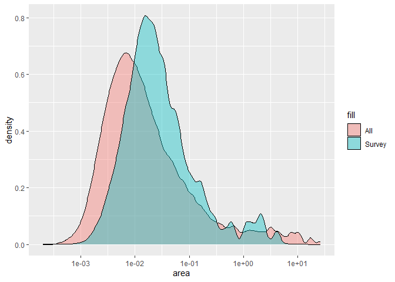
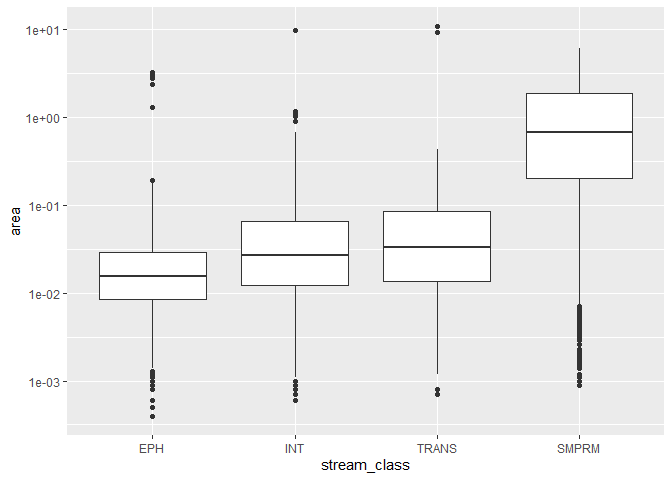
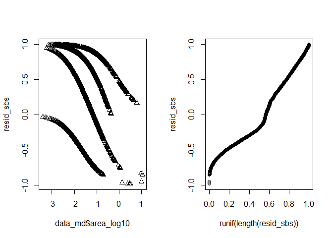
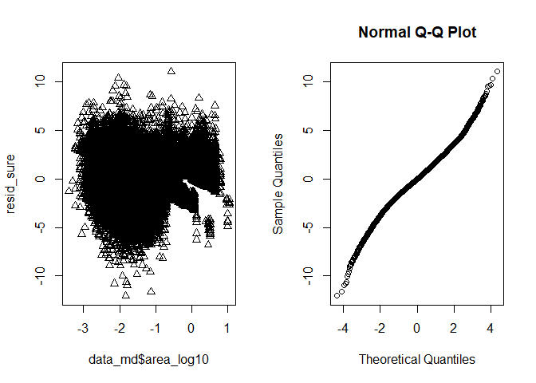
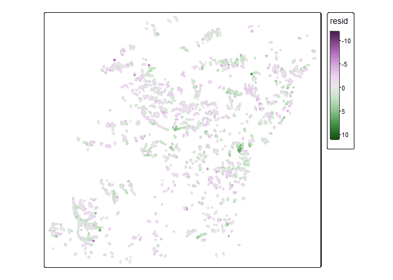
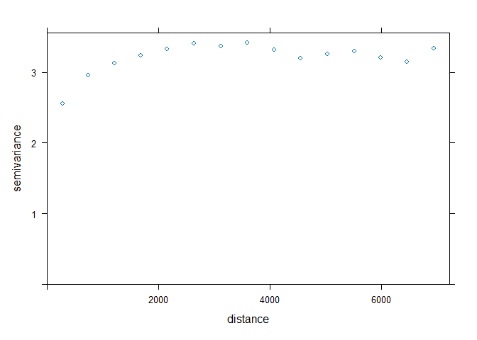
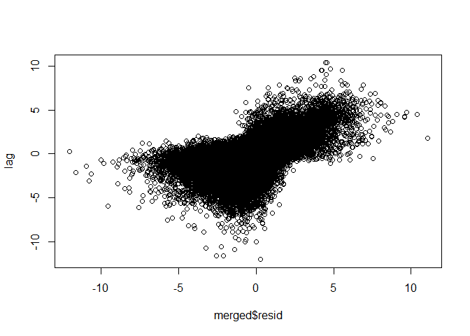

Ordinal logistic regression
================

``` r
suppressPackageStartupMessages({
  library(sf)
  library(terra)
  library(tmap)
  library(data.table)
  library(ggplot2)
  library(PResiduals)
  library(sure)
})
```

    ## Warning: package 'terra' was built under R version 4.4.1

    ## Warning: package 'PResiduals' was built under R version 4.4.2

``` r
# elev <- rast("streams_clipped/elev_areactest.tif")
nodes <- read_sf("streams_clipped/nodes_testc.shp")
cut_blocks <- read_sf("streams_clipped/cut_blocks.shp")
streams <- read_sf("streams_clipped/streams_clipped.shp")
```

``` r
# Make sure everything is in the same CRS
# set everything to utm 11N
cut_blocks <- st_transform(cut_blocks, "EPSG:26911")
#elev <- project(elev, "EPSG:26911")
st_crs(nodes) <- "EPSG:26911"

nodes[nodes$SurvReach == -9999, ]$SurvReach <- NA

survey_nodes <- nodes[!is.na(nodes$SurvType) & 
                        nodes$SurvType != "UNKN", ]


# # choose one cut block to work with
# block_id <- "S250922"
# block <- cut_blocks[cut_blocks$BLOCK_ID == block_id, ]
# 
# # trim nodes and streams 
# nodes <- nodes[block, ]
# streams_block <- streams[block, ]
```

In this notebook, I fit an ordinal model to a subset of the data and
evaluate some model fit diagnostics.

Here is what the data looks like:

``` r
# tm_shape(cut_blocks) +
#   tm_lines() +
#   tm_shape(nodes) + 
#   tm_dots(size = 0.05) +
#   tm_shape(streams) + 
#   tm_lines(col = "RIPARIAN_C", lwd = 2)
```

This is the distribution of all nodes in the network vs the nodes which
we have data for.

Survey nodes skew right. I wonder if this may be because nodes with low
contributing area often did not show up as channels (ie width = 0).

``` r
data <- nodes
st_geometry(data) <- NULL
setDT(data)

data <- data[, .(
  NodeNum, 
  stream_class = factor(SurvType, 
                        levels = c("EPH", 
                                   "INT", 
                                   "TRANS", 
                                   "SMPRM", 
                                   "LGPRM")), 
  area = AREA_SQKM, 
  area_log10 = log10(AREA_SQKM), 
  elev = ELEV_M, 
  grad20 = GRAD20, 
  mean_grad = MeanGrad
)]

data_md <- data[!is.na(stream_class)]


ggplot() +
  geom_density(data = data, aes(x = area, fill = "All"), alpha = 0.4) +
  geom_density(data = data_md, aes(x = area, fill = "Survey"), alpha = 0.4) +
  scale_x_continuous(trans = "log10") 
```

<!-- -->

``` r
ggplot(data_md) + 
  geom_boxplot(aes(x = stream_class, y = area)) + 
  scale_y_log10()
```

<!-- -->

``` r
# rms::lrm wasn't working for some reason
# but this presumably does the same thing
# (ordered logistic regression)
m1 <- MASS::polr(
  stream_class ~ area_log10, 
  data = data_md, 
  Hess = TRUE)
summary(m1)
```

    ## Call:
    ## MASS::polr(formula = stream_class ~ area_log10, data = data_md, 
    ##     Hess = TRUE)
    ## 
    ## Coefficients:
    ##            Value Std. Error t value
    ## area_log10 1.932    0.01365   141.6
    ## 
    ## Intercepts:
    ##             Value     Std. Error t value  
    ## EPH|INT       -3.1619    0.0232  -136.3691
    ## INT|TRANS     -1.2657    0.0208   -60.9890
    ## TRANS|SMPRM   -0.0963    0.0206    -4.6794
    ## SMPRM|LGPRM   14.8197   14.9465     0.9915
    ## 
    ## Residual Deviance: 145376.57 
    ## AIC: 145386.57

``` r
f <- fitted(m1)
head(f)
```

    ##         EPH       INT      TRANS      SMPRM        LGPRM
    ## 1 0.3800521 0.4232144 0.12605380 0.07067972 2.530609e-08
    ## 2 0.3810101 0.4228978 0.12567882 0.07041324 2.520345e-08
    ## 3 0.3814912 0.4227380 0.12549090 0.07027986 2.515210e-08
    ## 4 0.3829430 0.4222524 0.12492536 0.06987918 2.499793e-08
    ## 5 0.5151376 0.3610413 0.08178137 0.04203975 1.460186e-08
    ## 6 0.5200684 0.3582371 0.08044295 0.04125161 1.431634e-08

``` r
apply(f, 2, max)
```

    ##          EPH          INT        TRANS        SMPRM        LGPRM 
    ## 9.678419e-01 4.414584e-01 2.843096e-01 8.908256e-01 2.715052e-06

``` r
apply(f, 2, sum)
```

    ##          EPH          INT        TRANS        SMPRM        LGPRM 
    ## 3.529924e+04 2.299833e+04 7.656045e+03 6.865379e+03 4.206827e-03

# Residual analysis

First, we get residuals and plot them using SBS residuals in the
`PResiduals` package.

``` r
# get resid using SBS
resid_sbs <- presid(m1)

par(mfcol = c(1, 2))
plot(x = data_md$area_log10, y = resid_sbs, pch = 2)
qqplot(runif(length(resid_sbs)), resid_sbs)
```

<!-- -->

Next, we use surrogate residuals from the `sure` package.

``` r
resid_sure <- sure::resids(m1)

par(mfcol = c(1, 2))
plot(x = data_md$area_log10, y = resid_sure, pch = 2)
qqnorm(resid_sure)
```

<!-- -->

They look a bit funky, but it might be because our data is not evenly
distributed between classes. Let’s test for spatial autocorrelation.

``` r
# plot residuals
data_md$resid <- resid_sure
merged <- merge(data_md, nodes, by = "NodeNum", all.x = TRUE, all.y = FALSE) |> 
  st_as_sf()

tm_shape(merged) + 
  tm_dots(fill = "resid", 
          fill.scale = tm_scale_continuous())
```

    ## Variable(s) "fill" contains positive and negative values, so midpoint is set to 0. Set midpoint = NA to show the full range of visual values.

<!-- -->

``` r
# Spatial autocorrelation in resiuals
library(gstat)
```

    ## Warning: package 'gstat' was built under R version 4.4.1

``` r
library(spdep)
```

    ## Warning: package 'spdep' was built under R version 4.4.2

    ## Loading required package: spData

    ## Warning: package 'spData' was built under R version 4.4.2

    ## To access larger datasets in this package, install the spDataLarge
    ## package with: `install.packages('spDataLarge',
    ## repos='https://nowosad.github.io/drat/', type='source')`

``` r
# semivariogram
v <- variogram(resid ~ 1, merged)
plot(v)
```

<!-- -->

``` r
# Moran's I
# Set k nearest neighbors
nb <- knn2nb(knearneigh(merged, 1))
lw <- nb2listw(nb)
lag <- lag.listw(lw, merged$resid)
plot(merged$resid, lag)
```

<!-- -->

``` r
moran.test(merged$resid, lw)
```

    ## 
    ##  Moran I test under randomisation
    ## 
    ## data:  merged$resid  
    ## weights: lw    
    ## 
    ## Moran I statistic standard deviate = 153.42, p-value < 2.2e-16
    ## alternative hypothesis: greater
    ## sample estimates:
    ## Moran I statistic       Expectation          Variance 
    ##      6.978612e-01     -1.373287e-05      2.069077e-05

Based on the Moran’s I test, we have significant spatial autocorrelation
in the surrogate residuals. One issue here is that the observations are
on a reach level while our predictions are at a node level. Let’s try
again, aggregating data by reach.

To do this, I will create a sfnetwork object from the sf nodes object.

``` r
library(igraph)
library(tidygraph)
library(sfnetworks)
setDT(nodes)
#nodes <- st_as_sf(nodes)
edges <- nodes[, .(from = NodeNum, 
                    to = ToNode, 
                    type = SurvType,
                    channel_id = CHANNEL_ID, 
                    area = AREA_SQKM, 
                    elev = ELEV_M, 
                    grad = GRAD20, 
                    width_m = WIDTH_M, 
                    depth_m = DEPTH_M, 
                    incise = INCISE10
                    )]
edges[to == -9999, to := NA]
edges <- edges[!is.na(to)]

channel_network <- sfnetwork(nodes, edges)
# add geometry to edges (draw a straight line between nodes)
channel_network = convert(channel_network, to_spatial_explicit)
# aggregate by reach (remove intermediate nodes and concatenate edges)
lu <- function(x) length(unique(x))
channel_reaches <- convert(channel_network, to_spatial_smooth, 
                           summarise_attributes = list(
                             channel_id = unique, 
                             type = unique,
                             area = "max", 
                             elev = "mean", 
                             grad = "mean", 
                             width_m = "mean", 
                             depth_m = "mean", 
                             incise = "mean"))
```
