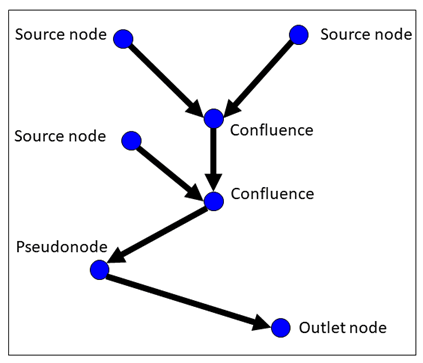

In this notebook, I read in the nodes shapefile, do some data cleaning, and 
save it as a .ssn object which can be used to fit spatial stream models using 
the SSN2 R package. 

```{r setup}
library(sf)
library(sfnetworks)
library(SSN2)
library(ggplot2)
library(data.table)
library(Matrix)


nodes <- read_sf("data/AreaC_Nodes/")
reaches <- read_sf("data/reaches/")
nodes$CLASS <-  as.numeric(factor(nodes$SurvType, 
                        levels = c("EPH", 
                                   "INT", 
                                   "TRANS", 
                                   "SMPRM", 
                                   "LGPRM")))
nodes$CLASS <- nodes$CLASS - 1

reaches$CLASS <- ifelse(reaches$CLASS %in% c(-9999, 0), NA, reaches$CLASS) - 1

# match up nodes to the nearest reach id
st_crs(nodes) <- st_crs(reaches)
nodes_matched <- st_join(nodes, reaches[c("REACH_ID")], all.x = TRUE, all.y = FALSE, join = st_nearest_feature)
names(reaches)
```

Now, do a bit of clean up. We need to make sure that all topology is valid, meaning that 
all intersections between stream lines follow one of the categories shown in the 
image below: 

```{r}

```

Invalid topology and suggestions on how to fix it are described in the [topology 
editing tutorial](https://github.com/pet221/SSNbler/blob/main/inst/tutorials/Topology_Editing/QGIS/TopologyEditing_QGIS.pdf). 

To identify node types, we create an adjacency matrix. The following code chunk 
chunk edits some node connections using the adjacency matrix. 

```{r prep_topology}
# Create adjacency matrix
# first need to index nodes from 1:n

make_A <- function(n_dt, N) {
  e <- n_dt[, .(from = nid, to = to_nid)]
  e <- e[!is.na(to)]
  
  sparseMatrix(i = e$from, 
               j = e$to, 
               x = 1, 
               dims = c(N, N))
}
n <- as.data.table(nodes)
setkey(n, NodeNum)
n$nid <- 1:nrow(n)

# There is one place in there that started out with a "Intersection without node" 
# error (crossing segments). Fix that one. 
n[.(596808), ToNode:= 596630]

# connect to downstream node using new ids
# This uses the data.table key to find the row where NodeNum == ToNode, then get 
# the new nid, and assign that to a new to_nid column
n$to_nid <- n[.(ToNode), nid]
setkey(n, nid)


# Now programmatically fix the other errors
N <- nrow(n)
A <- make_A(n, N)

# SSN does not allow confluences of more than two streams. Where this happens, 
# make one of them (the one with the smallest contributing area to avoid editing
# the main channel) converge one node farther down the network
complex_confluences <- which(colSums(A) == 3)

for (c in complex_confluences) {
  from_n <- n[to_nid == c]
  # to ensure that we move one of the side nodes and not the middle one, 
  # check the pairwise distances. The pair which are farthest from each other 
  # should be the two side channels. 
  from_n_sf <- nodes[nodes$NodeNum %in% from_n$NodeNum, ]
  dists <- st_distance(from_n_sf)
  max_dist <- which.max(dists)  # 3x3 mx
  sides <- c(max_dist %/% 3, ifelse(max_dist %% 3 == 0, 3, max_dist %% 3))
  from_n_sides <- from_n[NodeNum %in% from_n_sf[sides, ]$NodeNum]
  # choose the side with smallest contributing area
  n[.(from_n_sides[which.min(from_n_sides$AREA_SQKM), nid]),  to_nid := n[.(c), to_nid]]
}


# start with only sources, outlets, and confluences
sources <- which(colSums(A) == 0)
outlets <- which(rowSums(A) == 0)
confluences <- which(colSums(A) == 2)

# now make sure that there are no outlets which are also confluences. 
converging <- outlets[outlets %in% confluences]


# Move the smaller one up one for each of these
# This fails on 8916 because the lines still intersect. 
# for just this one, also delete the previous node. 
# TODO: figure out a better programmatic way to do this. 

  # if (c == 8916) {
  #   n <- n[nid != 8915]
  #   n[to_nid == 8915, to_nid := 8917]
  # }

for (c in converging) {
  from_n <- n[to_nid == c]
  n[.(from_n[which.min(from_n$AREA_SQKM), nid]), 
    to_nid := from_n[which.max(from_n$AREA_SQKM), nid]]
}

A <- make_A(n, N)
 
```

Now we should have an adjacency matrix describing valid topology between all nodes. 
Next, we create a network which only includes links between confluences. This is 
the minimum needed to describe the topology of the network. Info from nodes within 
these links can be added later to aid in model fitting and predictions. 
This can take a long time for a large number of nodes so we will do some longer 
operations in parallel. 

```{r make_edges}

# create new data tables which will hold info for reduced network

# start with only sources, outlets, and confluences
sources <- which(colSums(A) == 0)
outlets <- which(rowSums(A) == 0)
confluences <- which(colSums(A) == 2)

# exclude sources with 0 contributing area
sources <- n[nid %in% sources & AREA_SQKM > 0]$nid

# Start with node ids for only sources and confluences. Each of these 
# will correspond to one edge. 

new_n <- data.table(old_id = c(sources, confluences))
setorder(new_n, old_id)
new_n$new_id <- 1:nrow(new_n)
new_e <- data.table(from = new_n$new_id)
new_n <- rbind(new_n, data.table(old_id = outlets, new_id = 1:length(outlets) + nrow(new_n)))


# For each source or confluence node, get all nodes between it and the next 
# downstream confluence or outlet

# This takes a while for all 28k or so points so let's do it in parallel. 
library(parallel)
n_cores <- detectCores()
cl <- makeCluster(n_cores)
clusterEvalQ(cl, {
  library(data.table)
})

# recursive function to get all nodes (in order) from one confluence to the 
# next downstream one. 
get_downstream <- function(id, i = 1, n_list = id) {
  to = n[id, to_nid]
  # Don't include node 8915 because it makes a converging node (outlet and confluence)
  # TODO: figure out a better programmatic way to do this. 
  if (to != 8915) {
    n_list <- c(n_list, to)
  }
  i = i+1 
  # id <- to
  # to %in% c(confluences, outlets)
  if (to %in% c(confluences, outlets)) {
    return(list(to = new_n[old_id == to, new_id], i = i, n_list = n_list))
  } else {
    get_downstream(to, i, n_list)
  }
}


clusterExport(cl, c("n", "confluences", "outlets", "new_n", "get_downstream"))

sets <- parLapply(cl, new_n[new_e$from, old_id], get_downstream)


# Now use the list of nodes associated with each edge to get geometry for the 
# edge. 
n_sf <- st_as_sf(n)
clusterExport(cl, "n_sf")
clusterEvalQ(cl, {
  library(sf)
})

geometryList <- parLapply(cl, sets, \(s) {st_linestring(st_coordinates(n_sf)[s$n_list, ])}) 

new_e$geometry <- st_as_sfc(geometryList)
# record contributing area at most downstream point to use for SSN weighting
area_weights <- parLapply(cl, sets, \(s) {
  n[nid == s$n_list[length(s$n_list) - 1], AREA_SQKM]
})
new_e$area_weight <- unlist(area_weights)

# new_e$length <- unlist(lapply(sets, \(s) s$i))

new_e$to <- sapply(sets, \(s) s$to)
new_e$rid <- 1:nrow(new_e)
new_e <- st_as_sf(new_e, crs = st_crs(reaches))

# get nids so we can get info from nodes table later
 
setkey(new_n, new_id)
new_e$from_nodenum <- n[.(new_n[.(new_e$from), old_id]), NodeNum]
new_e$to_nodenum <- n[.(new_n[.(new_e$to), old_id]), NodeNum]

# get nids of center node of edge for predictions
new_e$center_nodenum <- n[.(unlist(lapply(sets, \(s) s$n_list[round(s$i/2)]))), NodeNum]

stopCluster(cl)
```

We are almost ready to create the .ssn object! But first, we must choose our 
observation and predictionp points. Each survey reach will correspond to one 
observation. We will use the center point of the reach as the observation location. 

```{r make_obs}
# set observation points as center point from each reach
# https://gis.stackexchange.com/questions/254151/how-to-find-the-center-point-which-lies-on-the-linestring-geometry 
reach_obs <- reaches[!is.na(reaches$CLASS), ]

reach_obs$geometry <- st_line_interpolate(st_geometry(reach_obs), 0.5, normalized = TRUE)
```

We will predict at each edge (link) that is greater than 2 nodes long. 
Prediction points will be at the center of the edge. 

```{r make_preds}

# predict at center(ish) node for each edge. 
# No predictions for edges only one node length long
setkey(n, NodeNum)
pred_points <- st_as_sf(n[.(new_e[new_e$length > 2, ]$center_nodenum)])
```

We have all the pieces we need. Now, use SSNbler to create the ssn object. 

```{r make_ssn}
library(SSN2)
library(SSNbler)
lsn.path <- file.path("data/ssn_files_keep", "lsn")


# Need to convert from data.table to data.frame (weird bugs happen otherwise)
  
# If confident about topology, set check_topology = FALSE and it will run quicker
edges <- lines_to_lsn(
  streams = st_as_sf(as.data.frame(new_e), crs = st_crs(new_e)),
  lsn_path = lsn.path,
  check_topology = FALSE,
  snap_tolerance = .1,
  topo_tolerance = .5,
  overwrite = TRUE
)
obs <- sites_to_lsn(
  sites = st_as_sf(reach_obs, crs = st_crs(reach_obs)),
  edges = edges,
  lsn_path = lsn.path,
  file_name = "obs",
  snap_tolerance = 1,
  save_local = TRUE,
  overwrite = TRUE
)
preds <- sites_to_lsn(
  sites = st_as_sf(as.data.frame(pred_points), crs = st_crs(pred_points)),
  edges = edges,
  save_local = TRUE,
  lsn_path = lsn.path,
  file_name = "pred",
  snap_tolerance = 1,
  overwrite = TRUE
)

edges <- updist_edges(
  edges = edges,
  save_local = TRUE,
  lsn_path = lsn.path,
  calc_length = TRUE
)

site.list <- updist_sites(
  sites = list(
    obs = obs,
    preds = preds
  ),
  edges = edges,
  length_col = "Length",
  save_local = TRUE,
  lsn_path = lsn.path
)

edges <- afv_edges(
  edges = edges,
  infl_col = "area_weight",
  segpi_col = "areaPI",
  afv_col = "afvArea",
  lsn_path = lsn.path
)

site.list <- afv_sites(
  sites = site.list,
  edges = edges,
  afv_col = "afvArea",
  save_local = TRUE,
  lsn_path = lsn.path
)

# ensure no obs ratio < 0 or > 1
site.list$obs$ratio <- ifelse(site.list$obs$ratio < 0, 0, site.list$obs$ratio)

reaches_ssn <- ssn_assemble(
  edges = edges,
  lsn_path = lsn.path,
  obs_sites = site.list$obs,
  preds_list = site.list[c("preds")],
  ssn_path = "data/ssn_files_keep/ssn.ssn",
  import = TRUE,
  check = TRUE,
  afv_col = "afvArea",
  overwrite = TRUE
)

```
