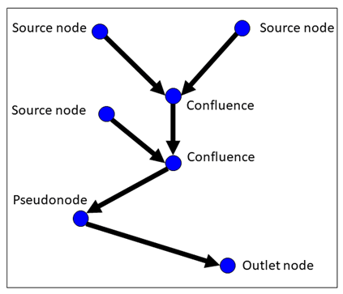
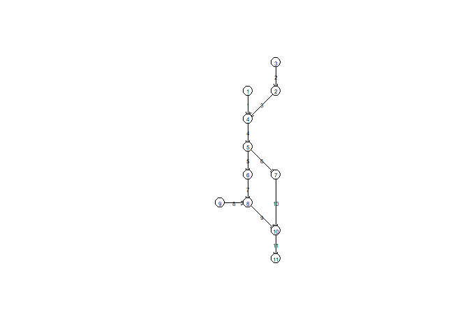

ssn
================

# SSN data object

## The Landscape Network (LSN):

Described in
[SSNbler](https://pet221.github.io/SSNbler/articles/introduction.html):
To skip topological alignment, five files are required (it expects .gpkg
files but shapefiles are also acceptable, I can convert them). These
files describe spatial and topological relationships. This describes
only the shape of the river, so only include source, confluence, and
outlet nodes. We may choose to include pseudonodes to break up reaches.
These different node types are described in the [SSNbler
documentation](https://pet221.github.io/SSNbler/articles/introduction.html)
and in the figure below:

<figure>

<figcaption aria-hidden="true">LSN</figcaption>
</figure>

The LSN includes the following files:

- `nodes.gpkg`
  - `POINT` geometry features representing nodes.
  - attributes:
    - `pointid`: unique node identifier
    - `nodecat`: node type (pseudonode, confluence, source, outlet)
- `edges.gpkg`
  - `LINESTRING` geometry representing paths between nodes
  - attributes:
    - whatever relevant attibutes you want
    - `rid`: unique reach identifier
- `nodexy.csv` csv file with a row for each node and three columns:
  - `pointid` (ids from `nodes.gpkg`)
  - `xcoord`
  - `ycoord`
- `noderelationships.csv` csv file with a row for each edge. Columns:
  - `rid` (ids from `edges.gpkg`)
  - `fromnode`: `pointid` of upstream node
  - `tonode`: `pointid` of downstream node
- `relationships.csv` csv file which describes relationships between
  edges. Columns:
  - `fromedge`: `rid` of edge
  - `toedge`: `rid` of downstream edge

## Observation and prediction points:

One file for each set of observation and prediction points. Each set of
points is saved as a `.gpkg` file with `POINT` geometry and includes all
relevant attributes needed for modeling and the following attributes
mapping it to the LSN:

- `rid`: The edge `rid` the observation falls on
- `ratio`: The site location on the edge, calculated by dividing the
  length of the edge found between the downstream end node and the site
  location by the total edge length.

# Example files

Example files are in ssn_demo. The network shown below will fail because
downstream divergences are not allowed.

``` r
library(sf)
```

    ## Linking to GEOS 3.12.1, GDAL 3.8.4, PROJ 9.3.1; sf_use_s2() is TRUE

``` r
nodexy <- data.frame(
  pointid = 1:11, 
  xcoord = c(2, 3, 3, 2, 2, 2, 3, 2, 1, 3, 3), 
  ycoord = c(7, 7 ,8, 6, 5, 4, 4, 3, 3, 2, 1)
)
noderelationships <- data.frame(
  rid = 1:11, 
  fromnode = c(1, 3, 2, 4, 5, 5, 6, 9, 8, 7, 10), 
  tonode = c(4, 2, 4, 5, 6, 7, 8, 8, 10, 10, 11)
)
relationships <- data.frame(
  fromedge = c(1, 2, 3, 4, 4, 5, 7, 8, 9, 6, 10), 
  toedge = c(4, 3, 4, 5, 6, 7, 9, 9, 11, 10, 11)
)
nodes <- st_as_sf(nodexy, coords = c("xcoord", "ycoord"))
nodes$nodecat <- c("Source", "Pseudonode", "Source", "Confluence", 
                   "Confluence", "Pseudonode", "Pseudonode", "Confluence", 
                   "Source", "Confluence", "Outlet")

lines <- lapply(1:11, \(e) {
  # edge from a to b
  node_a <- noderelationships[e, "fromnode"]
  node_b <- noderelationships[e, "tonode"]
  xy_a <- st_point(c(nodexy[node_a, ]$xcoord, nodexy[node_a, ]$ycoord))
  xy_b <- st_point(c(nodexy[node_b, ]$xcoord, nodexy[node_b, ]$ycoord))
  st_linestring(c(xy_a, xy_b))
})
edges <- st_as_sf(data.frame(rid = 1:11, 
                             geometry = st_sfc(lines)))

# Plot the network 
plot(st_geometry(nodes))
arrows(x0 = nodexy[noderelationships$fromnode, "xcoord"], 
       y0 = nodexy[noderelationships$fromnode, "ycoord"], 
       x1 = nodexy[noderelationships$tonode, "xcoord"],
       y1 = nodexy[noderelationships$tonode, "ycoord"], 
       length = .1, angle = 15)
plot(st_geometry(nodes), pch = 16, col = "white", add = TRUE, cex = 2)
plot(st_geometry(nodes), pch = 1, add = TRUE, cex = 2)
for (n in 1:11) {
  text(x = nodexy[n, "xcoord"], y = nodexy[n, "ycoord"], n, cex = .5)
}
e_c <- st_coordinates(st_centroid(edges))
```

    ## Warning: st_centroid assumes attributes are constant over geometries

``` r
text(x = e_c[, 1], 
     y = e_c[, 2], 
     1:11, cex = .5)
```

<!-- -->

``` r
# # Save files
# write.csv(nodexy, "ssn_demo/nodexy.csv", row.names = FALSE)
# write.csv(noderelationships, "ssn_demo/noderelationships.csv", row.names = FALSE)
# write.csv(relationships, "ssn_demo/relationships.csv", row.names = FALSE)
# write_sf(nodes, "ssn_demo/nodes.gpkg")
# write_sf(edges, "ssn_demo/edges.gpkg")
```

This will fail because SSN does not allow divergences (as occurs at node
5). Remove the segments which go through node 7.

``` r
lines <- lapply(1:11, \(e) {
  # edge from a to b
  node_a <- noderelationships[e, "fromnode"]
  node_b <- noderelationships[e, "tonode"]
  xy_a <- st_point(c(nodexy[node_a, ]$xcoord, nodexy[node_a, ]$ycoord))
  xy_b <- st_point(c(nodexy[node_b, ]$xcoord, nodexy[node_b, ]$ycoord))
  st_linestring(c(xy_a, xy_b))
})
# add one more area

newline <- st_linestring(c(
  st_point(c(10, 10)), 
  st_point(c(11, 11))
))
lines <- c(lines, list(newline))
edges <- st_as_sf(data.frame(rid = 1:12, 
                             geometry = st_sfc(lines)))

edges <- edges[(1:12)[-c(6, 10)], ]
st_crs(edges) <- "EPSG:26911"
# do I need observations? 

obs <- list(
  st_point(c(2, 4.5)), 
  st_point(c(2.1, 2.9)), 
  st_point(c(2.8, 6.8))
  )
obs <- st_as_sf(data.frame(
  temp = rnorm(3, 25, 1), 
  geometry = st_sfc(obs)
))
st_crs(obs) <- st_crs(edges)

plot(nodexy$xcoord, nodexy$ycoord, asp = 1)
plot(edges, add = TRUE)
plot(obs, add = TRUE, pch = 19)
```

<!-- -->

``` r
library(SSNbler)
edges <- lines_to_lsn(
  streams = edges,
  lsn_path = "ssn_demo",
  check_topology = TRUE,
  snap_tolerance = 0.05,
  topo_tolerance = .1,
  overwrite = TRUE
)
```

    ## 
    ## Saved ssn_demo/edges.gpkg

    ## Building Edge Relationships ...

    ## Checking network topology

    ## Saving ssn_demo/nodes.gpkg

    ## Building relationship tables....

    ## 
    ## 0 topology errors identified. node_errors.gpkg not written to file.
    ## 
    ## 2 Outlets found. Visually check nodecat == Outlet locations in ssn_demo/nodes.gpkg and correct errors if found.

``` r
obs <- sites_to_lsn(
  sites = obs, 
  edges = edges, 
  lsn_path = "ssn_demo", 
  file_name = "obs", 
  snap_tolerance = .1, 
  save_local = TRUE, 
  overwrite = TRUE
)
```

    ## 
    ## Finding locations on nearest edge segments

    ## Snapping points to edges

    ## Calculating ratio values

    ## Saving snapped sites ssn_demo/obs.gpkg

    ## FINISHED sites_to_lsn script successfully

    ## Snapped 3 out of 3 sites to LSN

``` r
# Now we can perform other operations like calculating upstream distance. 
edges <- updist_edges(edges, 
                      save_local = TRUE, lsn_path = "ssn_demo", 
                      calc_length = TRUE)
```

    ## 
    ## 
    ## Importing relationships.csv table

    ## 
    ## Identifying outlet segments

    ## Linking edge networks and outlets

    ## Calculating upstream distance

    ## Saving updated edges in ssn_demo

    ## FINISHED updist_edges successfully
