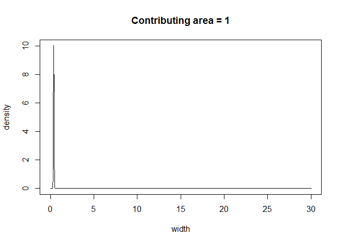
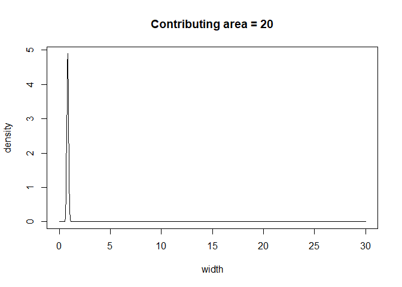
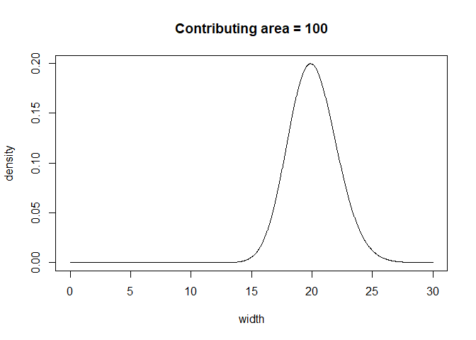
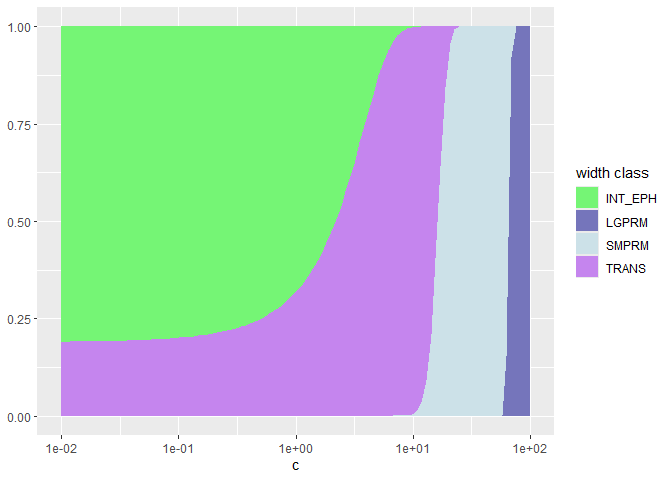

# A statistical model for stream width classes


``` r
suppressPackageStartupMessages({
  library(data.table)
  library(ggplot2)
})
```

# Ordinal regression

We want to predict the probability that that a given stream segment or
node will be in a given width class. Width class takes a number from 1
to 5, each corresponding to a different width range (1 = EPH (=0); 2 =
INT (\<= .4m); 3 = TRANS (\>0.4 to 0.7m), 4 = SMPRM (0.7 to 5.0m)), 5 =
LGPRM (\>5.0m)).

Let $y_s$ denote width class for location $s$ and $w_s$ be the
(continuous) width for that location, and $c_s$ be the contributing area
at that location. We assume that the width of a particular point on a
stream is drawn from a distribution, where that distribution is a
function of contributing area. Width is strictly positive, so we model
the distribution of width using a gamma distribution (other
distributions like exponential, lognormal or inverse gaussian could also
work). This can be represented as

$$
w_s \sim gamma(\mu_s, \phi) \\
$$ $$
\mu_s = f(c_s)
$$

where $\phi$ is a precision parameter which describes the shape of the
distribution.

We can choose $f(c_s)$ based on our knowledge of the system, or choose
it based on what fits the data best. Traditional linear regression would
set $$
log(\mu_s) = \alpha + \beta c_s.
$$ or $$
\mu_s = e^{\alpha + \beta c_s}
$$

This ensures that $\mu_s$ is always positive, and makes the mean of
width increase exponentially with contributing area.

Here are some examples of what this would look like for different
contributing areas. Setting $\alpha = -1$, $\beta = 0.04$ and
$\phi = 0.01$,

``` r
alpha <- -1
beta <- .04
phi <- .01

plot_width <- function(c) {
  mu <- exp(alpha + beta*c)
  
  a <- 1/phi
  b <- 1/(mu*phi)
  
  x <- seq(0, 30, length = 1000)
  plot(x, dgamma(x, a, b), type = "l", main = paste0("Contributing area = ", c), xlab = "width", ylab = "density")

}
# contributing area = 0.1
plot_width(1)
```



``` r
# contributing area = 10
plot_width(20)
```



``` r
# contributing area = 100
plot_width(100)
```



To get the probability that $s$ will be in width class $y$ from $w_s$,
we fit a series of parameters, $\theta_1, ... \theta_n$ such that

$$
P(y_s = k) = P(\theta_{k-1} < w_s \leq \theta_k). 
$$

If we use the same model as above, and set our cut points to correspond
to the different width classes:

$$
\theta_1 = 0.4
$$ $$
\theta_2 = 0.7 
$$ $$
\theta_3 = 5
$$

then we would get a distribution like this:

``` r
# for contributing area from 0.01 to 100 on log scale: 
contributing_area <- 10^seq(-2, 2, length = 100)
# for each value of contributing area, get 
# probability of being in each width class

get_ord_dist <- function(c) {
  mu <- exp(alpha + beta*c)
  
  a <- 1/phi
  b <- 1/(mu*phi)
  c(t1 = pgamma(0.4, a, b),
    t2 = pgamma(0.7, a, b) - pgamma(0.4, a, b), 
    t3 = pgamma(5, a, b) - pgamma(0.7, a, b), 
    t4 = 1 - pgamma(5, a, b))
  
}

ord_dist <- data.frame(t(sapply(contributing_area, get_ord_dist)))
setDT(ord_dist)
ord_dist$c <- contributing_area
ggplot(ord_dist) + 
  geom_ribbon(aes(x = c, ymin = 0, ymax = t4, fill = "LGPRM")) +
  geom_ribbon(aes(x = c, ymin = t4, ymax = t4 + t3, fill = "SMPRM")) + 
  geom_ribbon(aes(x = c, ymin = t4 + t3, ymax = t4 + t3 + t2, fill = "TRANS")) +
  geom_ribbon(aes(x = c, ymin = t4 + t3 + t2, ymax = 1, fill = "INT_EPH")) +
  scale_x_log10() +
  scale_fill_manual(name = "width class", 
                    values = c(LGPRM =  "#7575bb", 
                              SMPRM = "#cce1e8", 
                              TRANS = "#c585ee", 
                              INT_EPH = "#75f575"))
```



We can fit this to our data by setting the parameters in order to
maximize likelihood of observing our data. The likelihood is

$$
\mathcal{L} = Pr(\mathbf Y | \alpha, \beta, \phi, \mathbf\theta).
$$

In practice we minimize the negative log likelihood because it’s more
efficient computationally.

# Ordinal regression with spatial effect

It is likely that there will be spatial autocorrelation in our data.
Perhaps there are additional factors affecting stream width which we
have not accounted for and vary spatially. For example, one area may be
more heavily forested, steeper, or have different underlying geology
than another, affecting the relationship between contributing area and
stream width.

To correct for this, we can add a spatially correlated random variable
to our width estimation. We can represent this spatial autocorrelation
through a multivariate normal distribution. Here’s what the new model
looks like:

$$
w_s \sim gamma(\mu_s, \phi)
$$ $$
log(\mu_s) = \alpha + \beta c_s + \psi_s
$$ $$
\mathbf \psi \sim MVN(0, \Sigma)
$$

Where $\Sigma$ is the variance-covariance matrix for $\mathbf \psi$,
describing spatial autocorrelation. Now there are more parameters to
fit, including the values for the spatial random effect, $\mathbf \psi$,
and several parameters describing $\Sigma$.

There are a few ways to set $\Sigma$. In this case, we will want it to
represent the topology of the stream, with autocorrelation based on both
stream distance and euclidean distance.

If we had continuous stream width data, SSN could do this for us easily.
Unfortunately, we dont. We have ordinal stream width data, so we will
have to be a bit more creative. I’ve coded up some custom models using
[TMB](https://kaskr.github.io/adcomp/_book/Introduction.html), which can
be tricky to code and debug but quite efficient to fit once you get it
set up.

# Integrated model (different sampling types)

Our data may be from a mix of different surveys where different types of
data was collected on stream width. In this example, let’s say one
survey gives the width class of a stream segment, whereas another gives
the average width.

To estimate width of all segments, we can use an integrated model, as
described in Thorson and Kristensen (page 149). We can model our
observations, $y_i$ (now indexed by $i$ rather than $s$ to represent
that we may have more than one observation for a given segment) with the
distribution

$$
y_i \sim 
\begin{cases}
        Gamma(w, \phi) & \text{if } y_i \text{ samples width}\\
        Ord(Gamma(w, \phi)) & \text{if } y_i \text{ samples width class}
    \end{cases}
$$

where $Ord(Gamma(w, \phi))$ represents the ordinal distribution
described above. We can generalize our equation to include more possible
covariates. Denoting $X$ as the set of covariates, and $\beta$ as
parameters, we model width as

$$
w_i = e^{\mu_i}
$$ where $$
\mu_i = f_x(X_i, \beta) + \psi_i
$$

and $\psi$ is the spatial random effect, which follows a multivariate
normal distribution

$$
\psi \sim MVN(0, \Sigma).
$$

We can set $f_x(X,\beta)$ as anything we want. Methods exist for fitting
similar models where $f_x$ is fit as a random forest or other nonlinear
ML model ([available in the spmodel R
package](https://usepa.github.io/spmodel/reference/splmRF.html)).
