Width class (spatial model)
================

``` r
library(sf)
```

    ## Linking to GEOS 3.12.1, GDAL 3.8.4, PROJ 9.3.1; sf_use_s2() is TRUE

``` r
library(sfnetworks)
library(SSN2)
```

    ## Warning: package 'SSN2' was built under R version 4.4.1

``` r
library(ggplot2)
```

Here is an idea about how we might be able to model width and width
class where we have both point observations of width and depth, and
reach-level observations of width class. Below, I will simulate what
this data might look like and fit a model to it.

We model width $w_{s,r}$ at location $s$ in reach $r$ as a spatially
continuous variable. Width class $C_r$ is a function of all the
$w_{s,r}$ over reach $r$.

$$
C_r = \frac{1}{n_r}\sum_{i = 1}^{n_r} w_{i,r}\\
w_{s,r} \sim gamma(\mu, \phi) \\
log(\mu) = a_0 +\gamma_{s,r} + (a_1 + \psi_{s,r})x_{s,r}\\
\psi_{s,r} \sim MVN(0, R)\\
\gamma_{s,r} \sim MVN(0, S)
$$

Width class $C_r$ is the average width over reach $r$.

Width $w_{s,r}$ follows a gamma distribution around a mean $\mu$.

$\mu$ depends on an intercept $a_0$, and a covariate (contributing area)
$x_{s,r}$. The intercept is offset by a spatially varying error term,
$\gamma_{s,r}$, which follows a multivariate normal distribution
representing spatial autocorrelation. The effect of contributing area
also varies spatially, with this varying effect $\psi_{s,r}$ following a
multivariate normal distribution representing spatial autocorrelation.

Note that the distribution for $w$ is parameterized using the mean $\mu$
and disperison parameter $\phi$. In terms of the common parameterization
using shape $\alpha$ and scale $\beta$, $\alpha = \frac{1}{\phi}$ and
$\beta = \mu\phi$.

To simulate this, we first load a stream network. Use a small area so
that computations aren’t too slow.

``` r
# Fit ssn model to get covariance matrix 
library(data.table)
if (!file.exists("streams_clipped/nodes_of_interest.shp")) {
  nodes <- read_sf("streams_clipped/nodes_testc.shp")
  st_crs(nodes) <- "EPSG:26911"
  aoi <- read_sf("ssn_files_keep/ssn_test_region.shp")
  aoi <- st_transform(aoi, st_crs(nodes))
  n <- st_intersection(nodes, aoi)
  write_sf(n, "streams_clipped/nodes_of_interest.shp")
  rm(nodes)
} else {
  n <- read_sf("streams_clipped/nodes_of_interest.shp")
}


aoi <- read_sf("ssn_files_keep/ssn_test_region.shp")
aoi <- st_transform(aoi, st_crs(n))
reaches <- read_sf("reaches")
reaches <- st_transform(reaches, st_crs(n))
r <- st_intersection(reaches, aoi)
```

    ## Warning: attribute variables are assumed to be spatially constant throughout
    ## all geometries

``` r
n <- st_join(n, r[c("REACH_ID")], all.x = TRUE, all.y = FALSE, join = st_nearest_feature)

setDT(n)
# set new ids for indexing. 
setkey(n, NodeNum)
n$nid <- 1:nrow(n)
# connect to downstream node using new ids
n$to_nid <- n[.(ToNode), nid]
setkey(n, nid)


# edges
e <- n[, .(from = nid, to = to_nid)]
e <- e[!is.na(to)]

# For now just let length = 1 (evenly spaced nodes)
e$length <- 1
```

Create covariance matrix based only on downstream distance.

``` r
library(Matrix)
# set up

N <- nrow(n)
# Use contributing area for weights

## Parameters
# sigma <- 1.3 # variance parameter for x
# theta <- .04 # autocorrelation parameter
# alpha = 0 # intercept
# beta <- .1 # effect of x on width
# phi <- 20 # variance parameter for y

# simulate multivariate normal from precision matrix
rmvnorm_prec <-
function( mu, # estimated fixed and random effects
          prec, # estimated joint precision
          n.sims = 1) {

  require(Matrix)
  # Simulate values
  z0 = matrix(rnorm(length(mu) * n.sims), ncol=n.sims)
  # Q = t(P) * L * t(L) * P
  L = Cholesky(prec, super=TRUE)
  # Calcualte t(P) * solve(t(L)) * z0 in two steps
  z = solve(L, z0, system = "Lt") # z = Lt^-1 * z
  z = solve(L, z, system = "Pt") # z = Pt    * z
  return(mu + as.matrix(z))
}

make_stream_cov <- function(edges, 
                            nodes,
                            tailup = TRUE,
                            theta = .002, # autocorrelation parameter
                            prec = FALSE) {
  
  if (tailup) {
    from <- edges$from
    to <- edges$to
  } else {
    from <- edges$to
    to <- edges$from
  }
  N <- nrow(nodes)
  # adjacency matrix
  A <- sparseMatrix(i=from, 
                    j=to, 
                    x=1, 
                    dims=c(N,N) )
  sources <- which(colSums(A) < 1)
  confluences <- which(colSums(A) > 1)
  
  # weights matrix: at confluences, weight upstream nodes based on contributing
  # areas.
  
  if (tailup) {
    weights_mx <- A
    for (c in confluences) {
      # from 
      f <- which(A[, c] == 1)
      w <- nodes[f, AREA_SQKM]/(sum(nodes[f, AREA_SQKM]))
      weights_mx[f, c] <- w
    }
  } else {
    weights_mx <- 1
  }

  # autocorrelation for each path
  rho_mx <- sparseMatrix(i=from, 
                         j=to, 
                         x=exp(-theta*edges$length), 
                         dims=c(N,N) )
  
  # variance contribution to each x
  var_mx <- sparseMatrix(i=from, 
                         j=to, 
                         x=(1-exp(-2*theta*edges$length)), dims=c(N,N) )
  
  # path matrix: weights times autocorrelation (element-wise, not mx
  # multiplication)
  Gamma <- rho_mx * weights_mx
  
  # variance: weighted average for each x
  v <- apply((weights_mx * var_mx), 2, sum)
  # set variance for initial conditions
  v[sources] <- 1
  V <- diag(x=v)
  v_inv <- diag(x = 1/v)
  
  # construct precision matrix
  
  I <- diag(N)
  if (prec) {
    return(Matrix((I-Gamma) %*% v_inv %*% t(I-Gamma), sparse = TRUE))
  } else {
    return(Matrix(t(solve(I-Gamma)) %*% V %*% (solve(I-Gamma)), sparse = TRUE))
  }
}

# Precision (inverse covariance matrix)
# which is much sparser and faster.
Q_taildown <- make_stream_cov(e, n, tailup = FALSE, prec = TRUE)

Q_tailup <- make_stream_cov(e, n, tailup = TRUE, prec = TRUE)
```

Here’s what the different types of stream covariance matrices look like.
Precision matrices are always sparse. The tailup covariance matrix is
also sparse because it is only nonzero for flow-connected points.

``` r
image(Q_taildown, main = "Precision (tailup)")
```

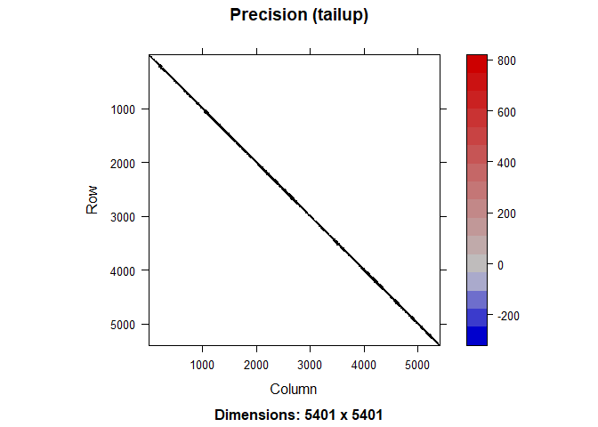<!-- -->

``` r
R_taildown <- make_stream_cov(e, n, tailup = FALSE, prec = FALSE)
image(R_taildown, useRaster = TRUE, main = "Covariance (taildown)")
```

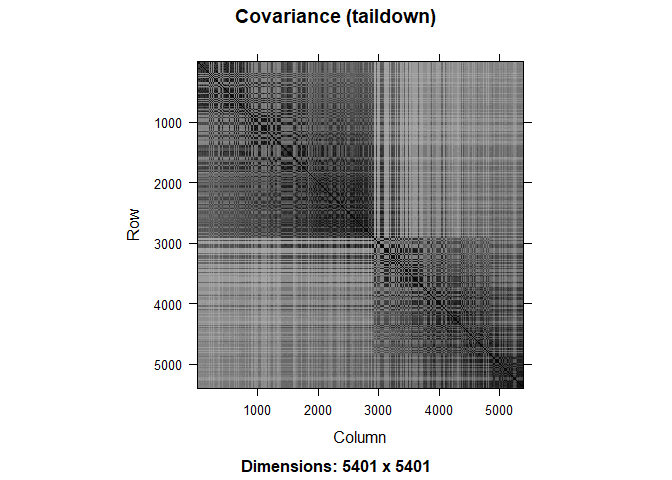<!-- -->

``` r
image(Q_tailup, main = "Precision (tailup)")
```

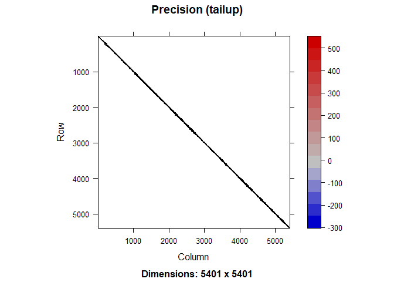<!-- -->

``` r
# tailup covariance matrix will also be sparse because it is only nonzero for
# nodes which are flow-connected.
R_tailup <- make_stream_cov(e, n, tailup = TRUE, prec= FALSE) 
image(R_tailup, useRaster = TRUE, main = "Covariance (tailup)")
```

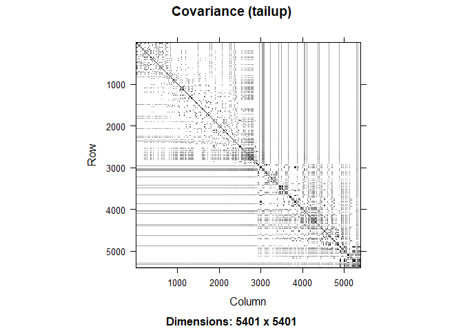<!-- -->

Simulate width at each point based on covariance matrix.

``` r
set.seed(10161994)

# Two spatial random effects. One which changes the coefficient for contributing
# area and one which changes the overall mean. Each can have different levels of
# spatial autocorrelation and variance. It will likely be hard to estimate both
# but let's see!

# random spatial effect which changes the coefficient for area. 
# psi_area <- rmvnorm_prec(rep(0, dim(Q)[1]), Q)


# random spatial effect which changes the mean. 
psi_mean_tailup <- rmvnorm_prec(rep(0, N), Q_tailup)
psi_mean_taildown <- rmvnorm_prec(rep(0, N), Q_taildown)
n$mu <- -3 + 3*n$AREA_SQKM + .05*psi_mean_tailup + 0.1*psi_mean_taildown

phi <- .1
n$w <- rgamma(length(n$mu), 1/phi, , exp(n$mu)*phi)
plot(st_as_sf(n)[, 'AREA_SQKM'], pch = 3, cex = .5)
```

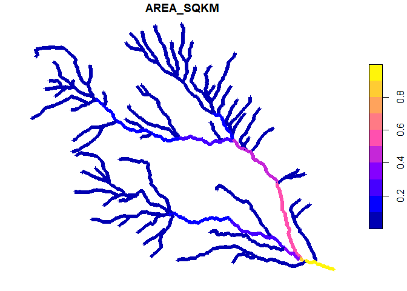<!-- -->

``` r
#plot(st_as_sf(n)[, 'psi_area'], pch = 3, cex = .5)
#plot(st_as_sf(n)[, 'psi_mean'], pch = 3, cex = .5)
plot(st_as_sf(n)[, 'w'], pch = 3, cex = .5)
```

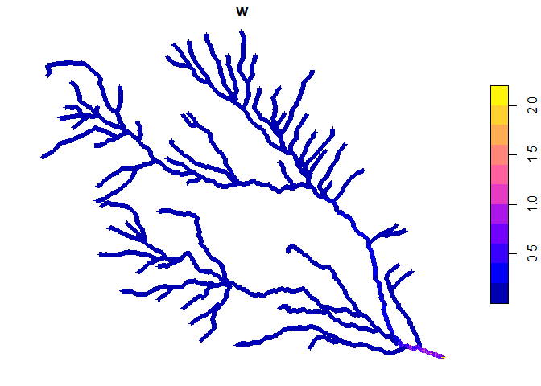<!-- -->

Simulate width class at each reach based on simulated widths.

``` r
mean_width <- n[, .(W = mean(w)), REACH_ID]
mean_width[, width_class := cut(W, c(0, .1, .4, .7, 5, 1000), FALSE)]

wc_cols <- sf.colors(4)
r <- merge(r, mean_width)
plot(r[, "width_class"], lwd = 3)
```

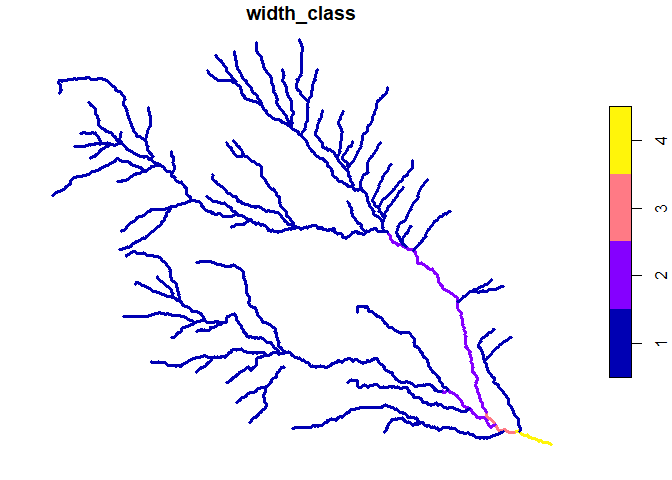<!-- -->

Sample some data.

``` r
set.seed(1001)
w_obs <- st_as_sf(n)[sample(1:nrow(n), 50),]
wc_obs <- r[sample(1:nrow(r), 40), ]

ggplot() + 
  geom_sf(data = r) + 
  geom_sf(data = wc_obs, aes(col = width_class), linewidth = 2) + 
  geom_sf(data = w_obs, aes(fill =w ), shape = 21, size = 3) +
  scale_color_stepsn("width class", breaks = c(0, 1, 2, 3, 4, 5), 
                    limits = c(0, 5), 
                    colors = sf.colors(5)) + 
  scale_fill_gradientn("width", trans = "log", colors = sf.colors(3), 
                       limits = range(n$w), 
                       breaks = c(0.01, 0.03, 0.09, 0.27, 0.81))
```

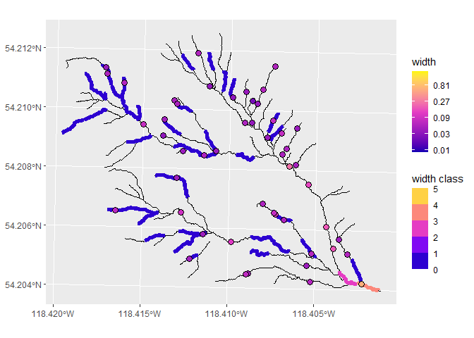<!-- -->

Fit our model to the data.

First fit using generalized linear model (GLM).

``` r
plot(w_obs$AREA_SQKM, w_obs$w, xlab= "Contributing area (km^2)", ylab = "Width (m)", main = "Observations (simulated)")
```

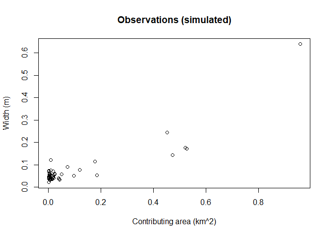<!-- -->

``` r
width_model <- glm(w ~ AREA_SQKM, data = w_obs, family = Gamma(link = "log"))


plot(n$w, predict(width_model, newdata = n, type = "response"),xlab = "Observations", ylab = "Predictions")
abline(0, 1, col = "red", lwd = 2)
```

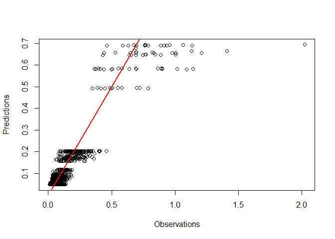<!-- -->

``` r
summary(width_model)
```

    ## 
    ## Call:
    ## glm(formula = w ~ AREA_SQKM, family = Gamma(link = "log"), data = w_obs)
    ## 
    ## Coefficients:
    ##             Estimate Std. Error t value Pr(>|t|)    
    ## (Intercept) -3.02048    0.05249  -57.55  < 2e-16 ***
    ## AREA_SQKM    2.69841    0.26234   10.29 9.98e-14 ***
    ## ---
    ## Signif. codes:  0 '***' 0.001 '**' 0.01 '*' 0.05 '.' 0.1 ' ' 1
    ## 
    ## (Dispersion parameter for Gamma family taken to be 0.1151191)
    ## 
    ##     Null deviance: 25.6212  on 49  degrees of freedom
    ## Residual deviance:  4.7344  on 48  degrees of freedom
    ## AIC: -254.08
    ## 
    ## Number of Fisher Scoring iterations: 4

First, just fit to point width data using SSN.

Make a LSN using just links

``` r
A <- sparseMatrix(i=e$from, 
                    j=e$to, 
                    x=1, 
                    dims=c(N,N) )

# start with only sources, outlets, and confluences
sources <- which(colSums(A) == 0)
outlets <- which(rowSums(A) == 0)
confluences <- which(colSums(A) == 2)

new_n <- data.table(old_id = c(sources, confluences))
setorder(new_n, old_id)
new_n$new_id <- 1:nrow(new_n)
new_e <- data.table(from = new_n$new_id)
new_n <- rbind(new_n, data.table(old_id = outlets, new_id = 1:length(outlets) + nrow(new_n)))

get_downstream <- function(id, i = 1, n_list = id) {
  to = n[id, to_nid]
  n_list <- c(n_list, to)
  i = i+1 
  # id <- to
  # to %in% c(confluences, outlets)
  if (to %in% c(confluences, outlets)) {
    return(list(to = new_n[old_id == to, new_id], i = i, n_list = n_list))
  } else {
    get_downstream(to, i, n_list)
  }
}
sets <- lapply(new_n[new_e$from, old_id], get_downstream)

n_sf <- st_as_sf(n)
new_e$geometry <- lapply(sets, \(s) {st_linestring(st_coordinates(n_sf)[s$n_list, ])}) |> 
  st_as_sfc()
new_e$area <- lapply(sets, \(s) {
    n[nid == s$n_list[length(s$n_list) - 1], AREA_SQKM]
}) |> unlist()
new_e$to <- sapply(sets, \(s) s$to)
new_e$rid <- 1:nrow(new_e)
new_e <- st_as_sf(new_e, crs = st_crs(r))


# predictions at unobserved sites
p <- n[!nid %in% w_obs$nid, ]
# also exclude ends of edges 
p <- p[!nid %in% c(sources, confluences, outlets)]
```

``` r
library(SSN2)
library(SSNbler)

if (!dir.exists("ssn_files_keep/ssn.ssn")) {
  lsn.path <- file.path(tempdir(), "stream_width")
  
  
  
  edges <- lines_to_lsn(
    streams = st_as_sf(as.data.frame(new_e), crs = st_crs(new_e)),
    lsn_path = lsn.path,
    check_topology = TRUE,
    snap_tolerance = 5,
    topo_tolerance = 20,
    overwrite = TRUE
  )
  obs <- sites_to_lsn(
    sites = st_as_sf(as.data.frame(w_obs), crs = st_crs(new_e)),
    edges = edges,
    lsn_path = lsn.path,
    file_name = "obs",
    snap_tolerance = 1,
    save_local = TRUE,
    overwrite = TRUE
  )
  preds <- sites_to_lsn(
    sites = st_as_sf(as.data.frame(n), crs = st_crs(new_e)),
    edges = edges,
    save_local = TRUE,
    lsn_path = lsn.path,
    file_name = "pred1km.gpkg",
    snap_tolerance = 1,
    overwrite = TRUE
  )
  
  edges <- updist_edges(
    edges = edges,
    save_local = TRUE,
    lsn_path = lsn.path,
    calc_length = TRUE
  )
  
  site.list <- updist_sites(
    sites = list(
      obs = obs,
      preds = preds
    ),
    edges = edges,
    length_col = "Length",
    save_local = TRUE,
    lsn_path = lsn.path
  )
  
  edges <- afv_edges(
    edges = edges,
    infl_col = "area",
    segpi_col = "areaPI",
    afv_col = "afvArea",
    lsn_path = lsn.path
  )
  
  site.list <- afv_sites(
    sites = site.list,
    edges = edges,
    afv_col = "afvArea",
    save_local = TRUE,
    lsn_path = lsn.path
  )
  reaches_ssn <- ssn_assemble(
    edges = edges,
    lsn_path = lsn.path,
    obs_sites = site.list$obs,
    preds_list = site.list[c("preds")],
    ssn_path = "ssn_files_keep/ssn",
    import = TRUE,
    check = TRUE,
    afv_col = "afvArea",
    overwrite = TRUE
  )
} else {
  reaches_ssn <- ssn_import("ssn_files_keep/ssn.ssn", predpts = "preds", overwrite = TRUE)
}

# SSN expects data.frames not data.tables
reaches_ssn$preds$preds <- st_as_sf(as.data.frame(reaches_ssn$preds$preds))
```

``` r
## Generate hydrologic distance matrices
ssn_create_distmat(reaches_ssn, predpts = "preds", overwrite = TRUE)

## Fit the model
ssn_mod <- ssn_glm(
  formula = w ~ AREA_SQKM,
  ssn.object = reaches_ssn, 
  family = "Gamma",
  tailup_type = "exponential",
  taildown_type = "exponential",
  additive = "afvArea"
)
summary(ssn_mod)
```

    ## 
    ## Call:
    ## ssn_glm(formula = w ~ AREA_SQKM, ssn.object = reaches_ssn, family = "Gamma", 
    ##     tailup_type = "exponential", taildown_type = "exponential", 
    ##     additive = "afvArea")
    ## 
    ## Deviance Residuals:
    ##        Min         1Q     Median         3Q        Max 
    ## -0.0097387 -0.0035830 -0.0004213  0.0023208  0.0140213 
    ## 
    ## Coefficients (fixed):
    ##             Estimate Std. Error z value Pr(>|z|)    
    ## (Intercept)  -3.0127     0.1289  -23.38   <2e-16 ***
    ## AREA_SQKM     2.8142     0.2651   10.61   <2e-16 ***
    ## ---
    ## Signif. codes:  0 '***' 0.001 '**' 0.01 '*' 0.05 '.' 0.1 ' ' 1
    ## 
    ## Pseudo R-squared: 0.7095
    ## 
    ## Coefficients (covariance):
    ##                 Effect     Parameter   Estimate
    ##     tailup exponential  de (parsill)  2.307e-03
    ##     tailup exponential         range  2.952e+03
    ##   taildown exponential  de (parsill)  7.968e-02
    ##   taildown exponential         range  5.030e+02
    ##                 nugget        nugget  5.822e-02
    ##             dispersion    dispersion  6.892e+02

``` r
plot(reaches_ssn$obs$w, fitted(ssn_mod))
abline(0, 1)
```

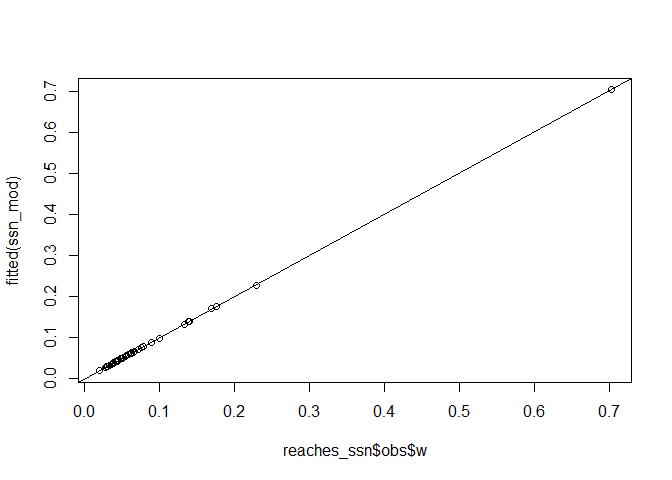<!-- -->

``` r
preds <- reaches_ssn$preds$preds
preds$predicted <- predict(ssn_mod, "preds", type = "response")
plot(preds[, "predicted"])
```

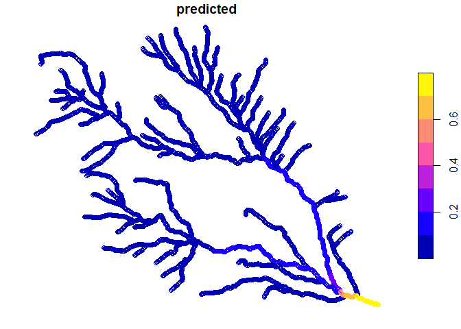<!-- -->

``` r
plot(preds$mu, log(preds$predicted), xlab= "mu", ylab = "Predicted mu")
abline(0, 1, col = "red", lwd = 2)
```

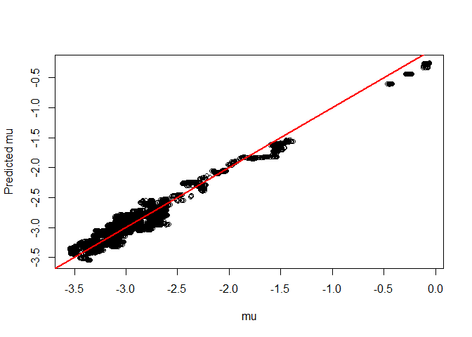<!-- -->

``` r
plot(preds$w, preds$predicted, xlab = "True width", ylab = "Predicted width")
abline(0, 1, col = "red", lwd = 2)
```

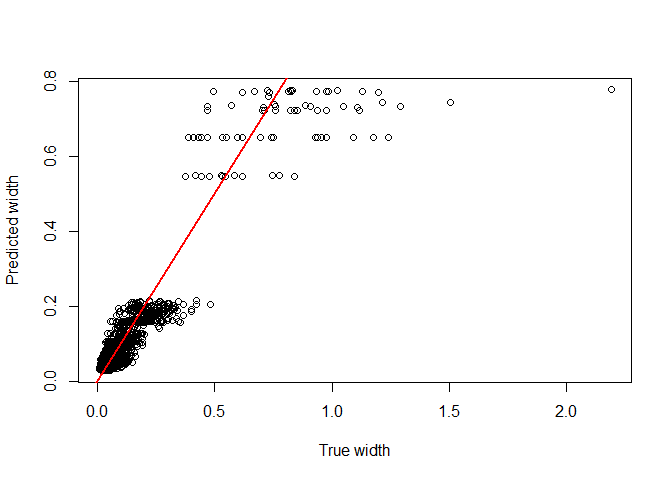<!-- -->

Both models do a good job of estimating parameters.

True intercept = -3.  
True slope = 3.

``` r
summary(width_model)
```

    ## 
    ## Call:
    ## glm(formula = w ~ AREA_SQKM, family = Gamma(link = "log"), data = w_obs)
    ## 
    ## Coefficients:
    ##             Estimate Std. Error t value Pr(>|t|)    
    ## (Intercept) -3.02048    0.05249  -57.55  < 2e-16 ***
    ## AREA_SQKM    2.69841    0.26234   10.29 9.98e-14 ***
    ## ---
    ## Signif. codes:  0 '***' 0.001 '**' 0.01 '*' 0.05 '.' 0.1 ' ' 1
    ## 
    ## (Dispersion parameter for Gamma family taken to be 0.1151191)
    ## 
    ##     Null deviance: 25.6212  on 49  degrees of freedom
    ## Residual deviance:  4.7344  on 48  degrees of freedom
    ## AIC: -254.08
    ## 
    ## Number of Fisher Scoring iterations: 4

``` r
summary(ssn_mod)
```

    ## 
    ## Call:
    ## ssn_glm(formula = w ~ AREA_SQKM, ssn.object = reaches_ssn, family = "Gamma", 
    ##     tailup_type = "exponential", taildown_type = "exponential", 
    ##     additive = "afvArea")
    ## 
    ## Deviance Residuals:
    ##        Min         1Q     Median         3Q        Max 
    ## -0.0097387 -0.0035830 -0.0004213  0.0023208  0.0140213 
    ## 
    ## Coefficients (fixed):
    ##             Estimate Std. Error z value Pr(>|z|)    
    ## (Intercept)  -3.0127     0.1289  -23.38   <2e-16 ***
    ## AREA_SQKM     2.8142     0.2651   10.61   <2e-16 ***
    ## ---
    ## Signif. codes:  0 '***' 0.001 '**' 0.01 '*' 0.05 '.' 0.1 ' ' 1
    ## 
    ## Pseudo R-squared: 0.7095
    ## 
    ## Coefficients (covariance):
    ##                 Effect     Parameter   Estimate
    ##     tailup exponential  de (parsill)  2.307e-03
    ##     tailup exponential         range  2.952e+03
    ##   taildown exponential  de (parsill)  7.968e-02
    ##   taildown exponential         range  5.030e+02
    ##                 nugget        nugget  5.822e-02
    ##             dispersion    dispersion  6.892e+02

Fit the same model using TMB (it should look the same)

``` r
# Tail-up model
library(TMB)
unlink("ssn_tmb/ssn_exponential_prec.dll")
unlink("ssn_tmb/ssn_exponential_prec.o")
compile( "ssn_tmb/ssn_exponential_prec.cpp" )
```

    ## using C++ compiler: 'G__~1.EXE (GCC) 13.2.0'

    ## [1] 0

``` r
dyn.load( dynlib("ssn_tmb/ssn_exponential_prec") )

Params <- list(
  logtheta1 =-2, # autocorrelation parameter (tailup)
  #logtheta2 = 0, # autocorrelation parameter (taildown)
  logphi = -2, # variance parameter for y
  beta0 = -1, # intercept
  beta1 = 1, # effect of x on y
  gamma1 = 1, # effect of spatial effect 1 on y 
  #gamma2 = 1, # effect of spatial effect 2 on y
  psi1_n = rnorm(nrow(n)) # spatial random effect 1
  #psi2_n = rnorm(nrow(n)) # spatial random effect 2
)

obs <- copy(n)
obs[!.(w_obs$nid), w:= NA]
Data <- list(
  y_n = obs$w,
  x_n = obs$AREA_SQKM,
  from_e = e$from -1, # index from 0
  to_e = e$to -1, # index from 0
  dist_e = e$length,
  flow_n = n$AREA_SQKM
)

Random <- c("psi1_n")

Obj <- MakeADFun(data = Data, 
                 parameters = Params,
                 random = Random,
                 silent=TRUE)


#invisible(capture.output( {

opt <- nlminb(start = Obj$par, 
              obj = Obj$fn,
              grad = Obj$gr)
rep <- Obj$report()

plot(obs$w, rep$mu_n)
abline(0, 1)
```

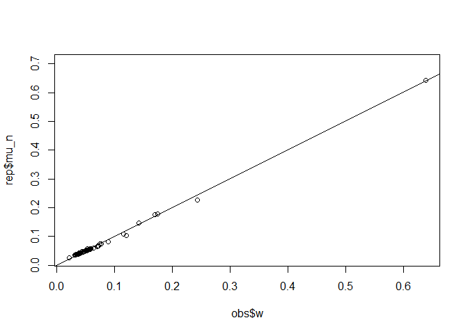<!-- -->

``` r
plot(n$w, rep$mu_n)
abline(0, 1, col = "red", lwd = 2)
```

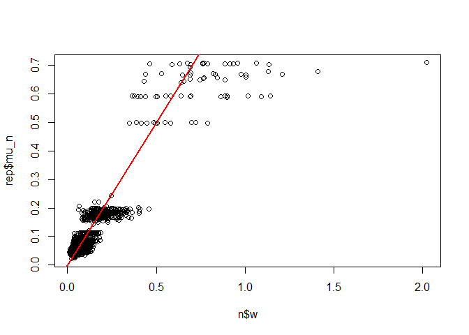<!-- -->

Calculate MSPE and compare between models

``` r
preds$tmb_pred <- rep$mu_n
oos <- preds[!preds$nid %in% w_obs$nid, ]
oos$lm_pred <- predict(width_model, newdata = oos, type = "response")

mspe_lm <- sum( (oos$w - oos$lm_pred)^2/nrow(oos) )
mspe_ssn <- sum( (oos$w - oos$predicted)^2/nrow(oos) )
mspe_tmb <- sum( (oos$w - oos$tmb_pred)^2/nrow(oos) )


data.table(
  model = c("linear", "ssn", "tmb"), 
  MSPE = c(mspe_lm, mspe_ssn, mspe_tmb)
) |> knitr::kable()
```

| model  |      MSPE |
|:-------|----------:|
| linear | 0.0021159 |
| ssn    | 0.0017568 |
| tmb    | 0.0113508 |

Fit integrated model using both width class and point width observations
